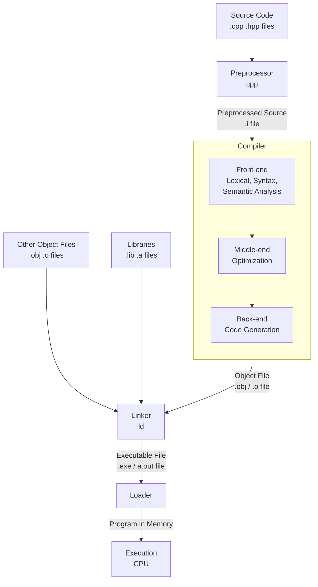

好的，当然可以！C++ 从源代码到最终执行是一个多阶段的自动化过程链，主要由四个核心阶段组成：**预处理 (Preprocessing)** -> **编译 (Compilation)** -> **链接 (Linking)** -> **加载和执行 (Loading & Execution)**。

下图清晰地展示了这一完整流程：

下面我为你详细分解每一个步骤。

---

### 阶段 1: 预处理 (Preprocessing)

**输入：** 原始的C++源文件（`.cpp`, `.hpp`, `.h` 等）
**输出：** 经过预处理后的源文件（通常为 `.i` 或 `.ii`）
**工具：** 预处理器 (通常是 `cpp`，但一般由编译器驱动，如 `g++ -E`)

预处理器在编译器本身开始工作之前，对源代码进行文本级别的处理和转换。你可以把它看作一个“文本替换工具”。它的主要任务包括：

*   **头文件包含 (#include)：** 将 `#include "header.h"` 或 `#include <library>` 指令直接替换为对应头文件的实际内容。
*   **宏展开 (#define)：** 展开所有宏定义。例如，`#define PI 3.1415`，之后所有的 `PI` 都会被替换成 `3.1415`。
*   **条件编译 (#if, #ifdef, #ifndef, #else, #endif)：** 根据条件判断，决定哪些代码块需要保留或剔除。这常用于平台特异性代码或调试代码。
*   **删除注释：** 将所有注释（`//` 和 `/* ... */`）替换为一个空格或直接删除。

**这一步完成后，会生成一个单一的、纯净的、包含了所有必要信息的“翻译单元”(Translation Unit)，供编译器下一步处理。**

---

### 阶段 2: 编译 (Compilation)

**输入：** 预处理后的源文件 (`.i`)
**输出：** 目标文件 (`.obj` 于 Windows / `.o` 于 Unix-like)
**工具：** 编译器 (如 `g++ -c`, `clang++ -c`, `cl /c`)

这是最核心的步骤，编译器将高级的C++代码翻译成机器可读的低级**目标代码**。这个过程本身又可以分为多个子阶段：

1.  **词法分析 (Lexical Analysis)：** 将字符流分解成一系列有意义的**词法单元**(Tokens)，比如关键字、标识符、运算符、字面量等。例如，`int a = 10;` 会被分解为 `int`, `a`, `=`, `10`, `;`。
2.  **语法分析 (Syntax Analysis)：** 根据C++语法规则，将Tokens组织成一个**抽象语法树 (Abstract Syntax Tree - AST)**。这棵树表示了代码的层次结构，检查语句是否符合语法规范。
3.  **语义分析 (Semantic Analysis)：** 在AST的基础上进行进一步分析，检查语义是否正确。例如：变量是否已声明、类型是否匹配、函数调用参数是否正确等。这是静态类型检查的核心。
4.  **中间代码生成与优化 (Intermediate Representation & Optimization)：** 将AST转换为一种与硬件无关的**中间表示(IR)**。编译器会基于IR进行各种优化，如常量折叠、死代码消除、循环优化等，以提升效率。
5.  **代码生成 (Code Generation)：** 将优化后的IR转换为目标机器的**汇编代码**(Assembly)或直接的**机器代码**(Machine Code)。
6.  **生成目标文件：** 将汇编代码/机器码、符号（函数名、变量名）、数据（常量、字符串）等信息打包成一个**目标文件(.obj/.o)**。

**关键点：** 此时的目标文件中的函数调用（例如调用其他文件中的函数）的地址是未知的，只是一个**未解析的引用(Undefined Reference)**。

---

### 阶段 3: 链接 (Linking)

**输入：** 所有目标文件 (`.obj`/`.o`) 和静态库文件 (`.lib`/`.a`)
**输出：** 可执行文件 (`.exe` 于 Windows / 无后缀 于 Unix-like) 或动态库 (`.dll`/`.so`)
**工具：** 链接器 (如 `ld`，通常由编译器驱动 `g++`, `clang++`)

一个程序通常由多个源文件编译成多个目标文件。链接器的任务就是**将这些分散的目标文件以及所需的库文件“拼接”成一个完整的可执行文件**。

它的主要工作是：

*   **符号解析 (Symbol Resolution)：** 收集所有目标文件中的符号（函数和变量名），建立一个全局符号表。
*   **地址重定位 (Relocation)：** 这是链接的核心魔法。链接器会确定每个符号在最终可执行文件中的**绝对内存地址**。然后，它回到所有目标文件中，将之前编译时留下的“未解析的引用”（那些未知的函数地址）全部替换成它刚刚计算出的**真实地址**。

**可能出现的错误：**
*   **undefined reference：** 链接器找不到某个符号的定义。原因可能是忘了链接库、拼写错误、没实现函数等。
*   **multiple definition：** 同一个符号被定义了多次，违反了单一定义规则(ODR)。

链接完成后，一个完整的、操作系统可以加载和运行的可执行文件就生成了。

---

### 阶段 4: 加载和执行 (Loading & Execution)

**输入：** 可执行文件
**输出：** 程序运行结果
**工具：** 操作系统加载器(Loader) + CPU

1.  **加载 (Loading)：** 当你双击或在命令行输入可执行文件名时，操作系统的**加载器(Loader)** 开始工作。它将磁盘上的可执行文件的内容（代码、数据）加载到**内存(RAM)** 的特定位置。
2.  **地址重定位（运行时）：** 现代操作系统使用虚拟内存。加载器可能会根据程序被加载到的实际内存地址，对代码中的一些绝对地址进行最后一次调整（现代可执行文件格式通常支持位置无关代码，减少了这一步的需要）。
3.  **执行 (Execution)：** 操作系统将程序的执行入口点（通常是 `main` 函数）地址设置到CPU的指令指针寄存器中。CPU从此开始，逐条从内存中 fetch（取指）、decode（译码）、execute（执行）机器指令，直到程序结束。

---

### 总结

这个过程链体现了“**分离编译，最后链接**”的思想，极大地提高了大型项目的开发效率。你可以单独编译每个模块，最后再统一链接。任何一个阶段出错，都会导致整个过程失败，并给出相应的错误信息（预处理错误、编译错误、链接错误或运行时错误）。