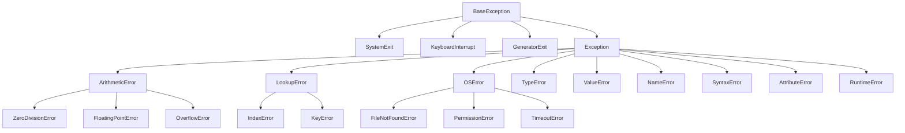

好的，我们来详细梳理一下 Python 中常见的异常类型。了解这些异常有助于你快速定位和修复代码中的问题。

Python 的所有异常都继承自 `BaseException` 类。我们日常处理的大多是它的子类 `Exception`。下图清晰地展示了常见异常之间的继承关系：



---

### 1. 语法错误（SyntaxError）

在代码执行前被解析器发现，程序无法运行。

*   **原因**：代码不符合 Python 的语法规则。
*   **常见场景**：
    *   缺少冒号 `:`
    *   括号不匹配
    *   错误的缩进
    *   错误的关键字拼写

```python
# 例1: 缺少冒号
if True # SyntaxError: expected ':'
    print("Hello")

# 例2: 括号不匹配
print("Hello" # SyntaxError: unexpected EOF while parsing
```

---

### 2. 索引错误（IndexError）

*   **原因**：尝试访问序列（列表、元组、字符串）中不存在的索引。
*   **常见场景**：列表索引超出范围。

```python
my_list = [1, 2, 3]
print(my_list[5]) # IndexError: list index out of range
```

---

### 3. 键错误（KeyError）

*   **原因**：尝试访问字典中不存在的键。
*   **常见场景**：拼写错误或忘记检查键是否存在。

```python
my_dict = {'name': 'Alice', 'age': 30}
print(my_dict['height']) # KeyError: 'height'
```

---

### 4. 类型错误（TypeError）

*   **原因**：操作或函数被应用于不适当类型的对象。
*   **常见场景**：
    *   不同类型数据之间的非法操作（如 `2 + '2'`）
    *   函数调用时参数数量错误
    *   迭代非可迭代对象

```python
# 例1: 字符串和数字相加
result = 10 + "5" # TypeError: unsupported operand type(s) for +: 'int' and 'str'

# 例2: 函数参数数量错误
len(1, 2) # TypeError: len() takes exactly one argument (2 given)

# 例3: 尝试迭代一个整数
for i in 42: # TypeError: 'int' object is not iterable
    pass
```

---

### 5. 值错误（ValueError）

*   **原因**：操作或函数接收到的参数类型正确，但值不合适。
*   **常见场景**：
    *   转换数据类型时格式错误
    *   列表的 `index()` 方法找不到值时

```python
# 例1: 将非数字字符串转为整数
num = int("abc") # ValueError: invalid literal for int() with base 10: 'abc'

# 例2: 列表查找不存在的值
my_list = [1, 2, 3]
position = my_list.index(4) # ValueError: 4 is not in list
```

---

### 6. 除零错误（ZeroDivisionError）

*   **原因**：试图除以零。
*   **常见场景**：数学计算中除数来自变量，但变量可能为0。

```python
result = 10 / 0 # ZeroDivisionError: division by zero
```

---

### 7. 属性错误（AttributeError）

*   **原因**：尝试访问对象没有的属性或方法。
*   **常见场景**：
    *   拼写错误
    *   错误地认为某个对象具有该属性

```python
my_list = [1, 2, 3]
my_list.appendh(4) # AttributeError: 'list' object has no attribute 'appendh'. Did you mean 'append'?
```

---

### 8. 文件未找到错误（FileNotFoundError）

*   **原因**：尝试打开或操作一个不存在的文件。
*   **常见场景**：文件路径错误或文件确实不存在。

```python
with open('non_existent_file.txt', 'r') as f:
    data = f.read() # FileNotFoundError: [Errno 2] No such file or directory: 'non_existent_file.txt'
```

---

### 9. 权限错误（PermissionError）

*   **原因**：没有足够的权限访问文件或资源（如尝试写入只读文件）。
*   **常见场景**：在无权限的目录中创建文件，或尝试修改只读文件。

```python
# 在无权限的目录（如系统根目录）中尝试创建文件
with open('/test.txt', 'w') as f:
    f.write('test') # PermissionError: [Errno 13] Permission denied: '/test.txt'
```

---

### 10. 名称错误（NameError）

*   **原因**：尝试访问一个未声明（未定义）的变量。
*   **常见场景**：变量名拼写错误或忘记定义。

```python
print(undefined_variable) # NameError: name 'undefined_variable' is not defined
```

---

### 11. 缩进错误（IndentationError）

`SyntaxError` 的一个子类，特指缩进问题。

*   **原因**：缩进不一致或错误。
*   **常见场景**：混用空格和制表符（Tab），或缩进级别不对。

```python
def my_func():
print("Hello") # IndentationError: expected an indented block after function definition
```

---

### 如何高效处理这些异常？

1.  **具体捕获**：尽量捕获具体的异常，而不是笼统地使用 `except Exception`。
2.  **提供友好信息**：在 `except` 块中给用户清晰提示。
3.  **日志记录**：在生产环境中，使用 `logging` 模块记录异常细节。

```python
try:
    num = int(input("请输入一个数字: "))
    result = 10 / num
    my_list = [1, 2, 3]
    print(my_list[5])
except ValueError:
    print("输入错误，请确保输入的是一个数字！")
except ZeroDivisionError:
    print("错误：除数不能为零！")
except IndexError:
    print("错误：尝试访问了列表不存在的索引！")
```

理解这些常见异常是成为高效 Python 开发者的关键一步！