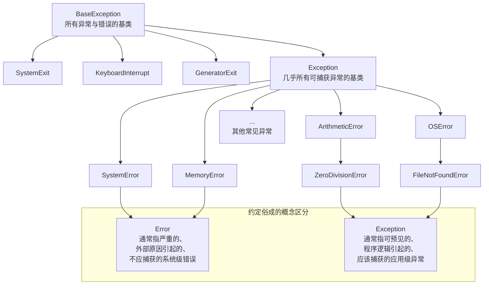

非常好且深刻的问题！**是的，Python 和 Java 一样，在概念上区分了“错误（Error）”和“异常（Exception）”，并且这种区分体现在它们的继承树上。**

虽然我们在日常编程中常说“处理异常”，但实际上在 Python 的异常体系里，`Exception` 和 `Error` 是有明确层级关系的。

---

### 1. 继承结构：一切的根源

Python 中所有“问题”的基类都是 `BaseException`。它主要有四个重要的直接子类：

1.  **`SystemExit`**：由 `sys.exit()` 引发，表示解释器请求退出。
2.  **`KeyboardInterrupt`**：当用户按下中断键（通常是 `Ctrl+C`）时引发。
3.  **`GeneratorExit`**：当生成器（Generator）被关闭时引发。
4.  **`Exception`**：**这是我们平常编程中几乎所有“可处理”的异常和错误的基类。**

而我们通常所说的 **“错误（Error）”** 和 **“异常（Exception）”** 都继承自 `Exception`。它们之间的区分更像是一种**约定俗成的概念**，而不是严格的语法区别。

下图清晰地展示了 Python 异常体系的完整继承结构，以及如何区分“错误”和“异常”：



---

### 2. 如何区分：约定大于规定

从上图可以看出，虽然 `Exception` 和 `Error` 在类名上有区别，但它们都源自同一个基类（`Exception`）。它们的区别更多是基于**编程实践和约定**：

| 特性 | **Exception（异常）** | **Error（错误）** |
| :--- | :--- | :--- |
| **可恢复性** | **通常可恢复**，程序可以继续运行 | **通常不可恢复**，应终止程序 |
| **产生原因** | 由**应用程序逻辑**引发（如无效输入、业务规则冲突） | 由**外部系统或环境**问题引发（如内存耗尽、栈溢出） |
| **处理方式** | **应该被捕获和处理**，是业务逻辑的一部分 | **通常不应该被捕获**（除了记录日志并优雅退出），捕获了也很难处理 |
| **代表例子** | `ValueError`, `KeyError`, `FileNotFoundError`, `自定义异常` | `MemoryError`, `SystemError`, `RecursionError`, `OverflowError` |

---

### 3. 与 Java 的对比

你的问题提到了 Java，这个对比非常贴切。**Python 的异常体系设计和 Java 非常相似**，但有一个关键区别：

| 语言 | **顶级基类** | **“错误”类** | **“异常”类** |
| :--- | :--- | :--- | :--- |
| **Java** | `Throwable` | `Error` (e.g., `OutOfMemoryError`) | `Exception` (e.g., `IOException`) |
| **Python** | `BaseException` | 继承自 `Exception` 的 `Error` (e.g., `MemoryError`) | `Exception` 的其他子类 (e.g., `ValueError`) |

**关键相似点**：两门语言都区分了严重的、不应捕获的“错误”和常见的、应该捕获的“异常”。

**关键不同点**：
*   在 **Java** 中，`Error` 和 `Exception` 是**并列关系**，都继承自 `Throwable`。
*   在 **Python** 中，我们概念上的 `Error` (如 `MemoryError`) 是 `Exception` 的**子类**，而 `Exception` 又继承自 `BaseException`。

---

### 4. 实践建议：该如何捕获？

1.  **几乎总是捕获 `Exception`**：
    ```python
    try:
        # 你的代码
        risky_call()
    except Exception as e:
        # 这会捕获所有编程层面的、可预见的问题
        # 包括 ValueError, FileNotFoundError 等“异常”，也包括 MemoryError 等“错误”
        log_error(e)
        show_friendly_message_to_user()
    ```

2.  **不要轻易捕获 `BaseException` (或空 `except:`)**：
    ```python
    try:
        # 你的代码
    except BaseException: # 或者空的 except:
        # 这会捕获 EVERYTHING，包括 KeyboardInterrupt (Ctrl+C) 和 SystemExit
        # 这意味着你的程序可能无法通过 Ctrl+C 正常退出，这是非常危险的！
        print("Caught everything, even your Ctrl+C!")
    ```
    **除非**你在编写一个必须捕获所有信号的高级框架（如监控程序），否则请避免这样做。

3.  **对于真正的“错误”，通常的处理方式是记录并退出**：
    ```python
    try:
        run_my_application()
    except MemoryError:
        # 捕获到内存错误，记录下这个严重问题，然后优雅地退出
        logging.critical("The system is out of memory! Shutting down.")
        sys.exit(1) # 用非0状态码退出，表示错误
    except Exception as e:
        # 处理其他普通的异常
        logging.error(f"An application error occurred: {e}")
        show_error_message(e)
    ```

### 总结

*   **是的，Python 区分“错误”和“异常”**，但这种区分主要体现在**编程约定和概念上**，而不是严格的继承树分离（Java 是分离的）。
*   **`Exception` 是所有常见可捕获问题的基类**，它包含了我们通常说的“异常”（如 `ValueError`) 和“错误”（如 `MemoryError`）。
*   在实践中，你应该**捕获 `Exception`** 来处理程序逻辑中的问题，而让那些真正的系统级“错误”暴露出来，或者在最顶层捕获它们以便记录日志并优雅地终止程序。