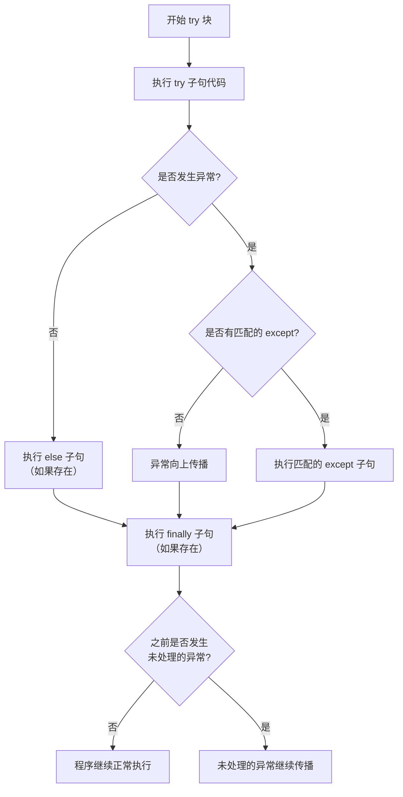

好的，我们来深入、仔细地剖析 Python 中的 `try` 语句。它是异常处理的核心，理解其每个子句的执行顺序和适用场景至关重要。

一个完整的 `try` 语句包含四个可能的子句：`try`, `except`, `else`, 和 `finally`。它们的组合和執行流程可以用以下流程图清晰地展示：



---

### 1. `try` 子句 (The `try` Clause)

*   **目的**：包裹可能会引发异常的**核心代码**、**危险操作**。
*   **规则**：
    *   必须有且仅有一个 `try` 子句。
    *   必须至少跟随一个 `except` 或 `finally` 子句（不能单独存在）。

```python
try:
    # 这里是可能会“引爆”的代码
    risky_operation()
```

---

### 2. `except` 子句 (The `except` Clause)

*   **目的**：**捕获并处理**在 `try` 块中发生的特定异常。
*   **规则**：
    *   可以有多个 `except` 子句来处理不同类型的异常。
    *   匹配是**顺序敏感**的：解释器会按从上到下的顺序检查 `except` 块，执行第一个匹配的块。

#### 多种写法：

**a) 捕获特定异常：**
```python
try:
    # ...
except ValueError:
    print("处理值错误")
except TypeError:
    print("处理类型错误")
```

**b) 捕获异常并获取异常对象（推荐）：**
使用 `as` 关键字将异常对象赋值给一个变量，可以获取详细的错误信息。
```python
try:
    x = int("not_a_number")
except ValueError as e: # 'e' 是异常对象
    print(f"发生了值错误: {e}") # 输出: 发生了值错误: invalid literal for int() with base 10: 'not_a_number'
```

**c) 捕获多个异常：**
用一个元组将多个异常组合在一起，用一个 `except` 块处理。
```python
try:
    # ...
except (ValueError, TypeError) as e:
    print(f"发生了值或类型错误: {e}")
```

**d) 捕获所有异常（谨慎使用！）：**
```python
try:
    # ...
except Exception as e: # 推荐方式：捕获所有继承自 Exception 的异常
    print(f"发生了一个错误: {e}")

# 或（极度不推荐）
except: # 这会捕获包括 KeyboardInterrupt 在内的所有异常，可能阻止程序正常退出
    print("发生了某种错误")
```

---

### 3. `else` 子句 (The `else` Clause)

*   **目的**：定义一段**仅在 `try` 块中没有发生任何异常时才会执行**的代码。
*   **位置**：必须在所有 `except` 子句之后。
*   **优势**：
    *   **逻辑清晰**：将“正常流程”和“错误处理流程”分开，避免了在 `try` 块末尾写大量可能成功的代码，从而意外捕获到本不该由这个 `try` 捕获的异常。
    *   **性能**：避免了由于将额外代码放在 `try` 块中而带来的微小性能开销。

```python
try:
    file = open('data.txt', 'r')
    data = file.read() # 如果这里出错，file.close() 就不会执行
except FileNotFoundError:
    print("文件找不到")
else:
    # 只有在文件成功打开和读取后，才处理数据
    # 这里的异常（如数据处理错误）不会被上面的 except 捕获
    numbers = [int(line) for line in data.splitlines()]
    print(f"平均值是: {sum(numbers) / len(numbers)}")
    file.close() # 关闭操作放在 else 里也很合适
```

---

### 4. `finally` 子句 (The `finally` Clause)

*   **目的**：定义一段**无论是否发生异常都必须执行**的清理代码。
*   **位置**：必须是整个 `try` 语句的最后一个子句。
*   **关键特性**：
    *   `finally` 子句中的代码**总会执行**。
    *   如果 `try` 或 `except` 块中有 `return`, `break`, 或 `continue` 语句，**`finally` 会在这些语句执行前运行**。
    *   如果 `finally` 块中有 `return` 或 `raise`，它会**覆盖**之前块中的返回值或异常。

**经典用法：资源清理**
```python
file = None
try:
    file = open('important_file.txt', 'w')
    file.write('Some important data')
    # 即使这里发生异常，finally 也会确保文件被关闭
except IOError as e:
    print(f"写入文件时出错: {e}")
finally:
    print("执行清理操作...")
    if file is not None and not file.closed:
        file.close() # 确保文件资源总是被释放
```

**演示 `finally` 的强大之处：**
```python
def test_finally():
    try:
        print("在 try 块中")
        return "Returned from try" # 1. 先看到这个 return
    except:
        pass
    finally:
        print("在 finally 块中") # 2. 但 finally 会在 return 之前执行！
        # 如果这里也有 return，会覆盖 try 里的 return

    return "Returned from end"

result = test_finally()
# 输出:
# 在 try 块中
# 在 finally 块中
# print(result) -> "Returned from try"
```

---

### 完整的执行流程总结

结合开头的流程图，一个 `try` 语句的执行顺序如下：

1.  **执行 `try` 子句**中的代码。
2.  **如果没有异常发生**：
    *   跳过所有 `except` 子句。
    *   如果存在 `else` 子句，则执行它。
    *   最后，执行 `finally` 子句（如果存在）。
3.  **如果发生了异常**：
    *   中断 `try` 子句的执行。
    *   按顺序检查 `except` 子句，找到第一个与异常类型匹配的子句并执行它。
    *   如果找到匹配的 `except`，异常被视为已处理，程序继续执行 `finally` 子句（如果存在），然后继续执行 `try` 语句之后的代码。
    *   如果**没有找到匹配**的 `except` 子句，异常会**先传播**出去，但**在传播之前，会先执行 `finally` 子句**。执行完 `finally` 后，未处理的异常继续向上层传播。

### 最佳实践

1.  **具体异常**：始终捕获尽可能具体的异常。
2.  **善用 `else`**：用 `else` 来存放那些依赖于 `try` 成功执行且本身不应被 `try` 的 `except` 捕获的代码。
3.  **依赖 `finally`**：将所有关键的清理代码（如关闭文件、释放锁、断开网络连接）放在 `finally` 子句中，以保证其必然执行。
4.  **保持 `try` 块精简**：只在 `try` 中放入可能引发目标异常的代码，避免掩盖其他错误。

通过熟练掌握 `try` 语句的这四个部分，你可以编写出既健壮又清晰的错误处理代码。