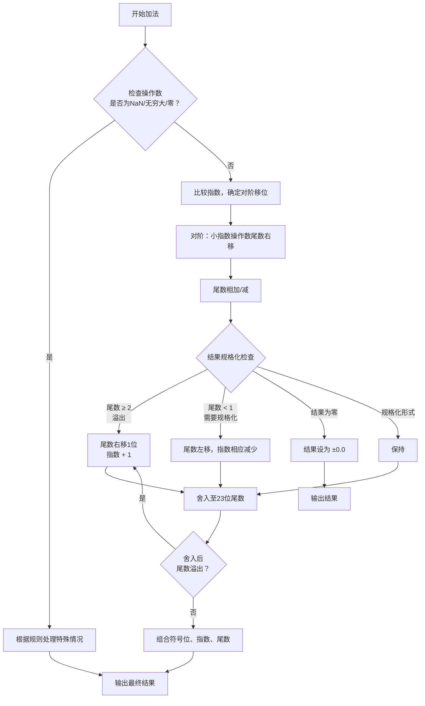

好的，我们来深入讲解一下浮点数加法的过程。与乘法相比，加法在概念上更直观，但在实现上却更为复杂，其核心难点在于 **对阶** 操作。

### 核心思想：科学计数法加法

回想一下如何计算两个科学计数法表示的数：
\( (A \times 10^a) + (B \times 10^b) \)

你不能直接相加系数 A 和 B，除非它们的指数相同。所以你需要：
1.  将指数较小的数进行移位，使其指数与较大的指数对齐。
2.  将移位后的系数相加。
3.  将结果规格化。

浮点数加法完全遵循这个模式。

---

### 浮点数加法的详细步骤

假设我们有两个遵循 IEEE 754 标准的浮点数（以单精度 `float` 为例）：
`a = (-1)^s1 * (1.m1) * 2^(e1-127)`
`b = (-1)^s2 * (1.m2) * 2^(e2-127)`

它们的和 `s = a + b` 的计算过程如下：

#### 步骤 0：操作数检查

这是一个并行进行的预处理步骤。检查输入操作数是否为特殊值：
- **如果一个操作数是 `NaN`**，结果直接是 `NaN`。
- **如果一个是无穷大**：
  - 另一个也是同号无穷大，结果是相同符号的无穷大。
  - 另一个是异号无穷大，结果是 `NaN`（这是 `∞ - ∞` 的情况）。
  - 另一个是有限数，结果是该无穷大。
- **如果一个是零**：
  - 另一个是有限数，结果可能就是另一个数（在后续步骤中处理更精确）。

如果都是普通数值，则继续下面的步骤。

#### 步骤 1：对阶

这是加法最关键的一步。目标是让两个数的指数相同，以便尾数能够直接相加。

- **比较指数**：计算 `e1 - e2`（实际指数的差值）。
- **寻找较大指数**：确定 `e1` 和 `e2` 中较大的一个。结果的指数 `e_s` 将被预设为这个较大的指数。
- **移位尾数**：将指数较小的那个数的尾数 **右移**，右移的位数等于 `|e1 - e2|`。
  - 在移位过程中，**被移出的位不能简单地丢弃**，它们会被保留为 **保护位**、**舍入位** 和 **粘滞位**，用于后续的舍入操作，以保持计算精度。
  - **重要**：由于规格化数的尾数是 `1.m`，所以在移位前，我们需要将隐含的 `1` 显式地加入到尾数的最高位，形成一个 **24 位** 的有效数字（1位整数 + 23位小数）再进行操作。

**例子（十进制科学计数法模拟）：**
计算 \( 1.500 \times 10^3 + 2.500 \times 10^1 \)
1.  比较指数：3 和 1，较大者是 3。
2.  将对齐 `2.500 x 10^1`：将其尾数右移 (3-1)=2 位 -> `0.025 x 10^3`。
3.  现在两者指数都是 3，可以相加：`1.500 + 0.025 = 1.525`。
4.  结果是 `1.525 x 10^3`。

#### 步骤 2：尾数相加

现在两个数的指数已经对齐，可以对尾数进行加减。
- **根据符号位决定操作**：使用补码加法器进行。
  - 如果符号相同 (`s1 == s2`)，则执行 **加法**。(`|A| + |B|`)
  - 如果符号不同 (`s1 != s2`)，则执行 **减法**。(`|A| - |B|`，其中 |A| 是较大数的有效值)

- **结果的符号**：结果的符号由加法器的输出决定。
  - 如果是加法且符号相同，结果符号与操作数相同。
  - 如果是减法，结果的符号取绝对值较大的那个操作数的符号。

#### 步骤 3：结果规格化

相加/相减后的尾数可能不是规格化形式（即不是 `1.xxx...` 的形式），需要进行调整。

- **情况A：尾数溢出**（结果 ≥ 2）
  - 例如，二进制结果可能是 `10.1101...` 或 `11.0010...`。
  - **操作**：将尾数 **右移 1 位**，同时将指数 `e_s` **加 1**。
  - 结果变为 `1.01101...`。

- **情况B：尾数非规格化**（结果 < 1）
  - 这在减法中非常常见，称为 **抵消** 或 **有效位取消**。
  - 例如，计算 `1.000 x 10^0 - 0.999 x 10^0`，结果是 `0.001 x 10^0`。
  - **操作**：寻找尾数中第一个为 `1` 的位，将其左移直到尾数变成 `1.xxx...` 的形式。同时，指数 `e_s` 要 **减去** 左移的位数。

- **情况C：结果为零**
  - 如果尾数相减后结果为零，根据标准，通常将结果设置为 **+0.0**（除非舍入模式是向负无穷，则结果为 -0.0）。

#### 步骤 4：舍入

现在我们有了一个规格化的尾数结果，但其精度可能超过了 24 位（包括隐含的1）。我们必须将其舍入到 23 位的尾数字段。

- 这个过程与乘法中的舍入完全相同。
- 利用在步骤 1（对阶移位）和步骤 3（规格化移位）中保留的保护位、舍入位和粘滞位。
- 根据当前设置的舍入模式（如“向最接近的偶数舍入”），决定是否需要对第23位进行“进一”操作。

**同样，舍入操作可能导致尾数再次溢出**（例如从 `1.111...1` 进一变成 `10.000...0`）。如果发生这种情况，需要回到 **步骤 3**，再次进行规格化（右移尾数，指数加1）。

#### 步骤 5：包装结果

将最终的符号位 `s_s`、指数位 `e_s` 和舍入后的 23 位尾数 `m_s` 组合起来，形成一个符合 IEEE 754 标准的 32 位浮点数。

---

### 总结流程

浮点数加法的数据通路可以简化为以下流程图：

### 关键难点：与乘法的对比

| 特性 | 浮点数乘法 | 浮点数加法 |
| :--- | :--- | :--- |
| **核心操作** | 尾数 **相乘**，指数 **相加** | 尾数 **相加**，需要 **对阶** |
| **复杂度** | 尾数相乘（硬件乘法器）成本高，但步骤直接。 | **对阶** 操作（桶形移位器）和**结果规格化**（前导1预测）更复杂。 |
| **主要损耗** | 计算 24x24 位乘法。 | 在 **对阶** 时，小指数数的有效数字可能因右移而丢失，导致精度损失。 |
| **特殊状况** | 相对简单。 | **有效位抵消**：当两个数大小相近但符号相反时，相减会导致有效位数大幅减少，精度严重丧失。 |

希望这个详细的解释能帮助你彻底理解浮点数加法的精妙与复杂之处！