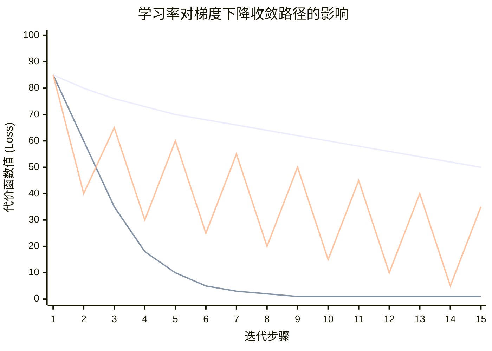

好的，我们来深入探讨一下**学习率**——这个在梯度下降中至关重要、却又常常令人困惑的超参数。

### 1. 核心比喻：下山步长

让我们再次使用“雾天下山”的比喻：
- **梯度**：告诉你最陡的下山**方向**。
- **学习率**：决定你朝着这个方向**迈出的步长**。

**学习率（通常记为 α 或 η）** 是一个控制我们在每次参数更新时步长大小的正数。它在梯度下降的更新公式中扮演着核心角色：
`新参数 = 旧参数 - 学习率 × 梯度`

---

### 2. 学习率的不同取值及其影响

学习率的选择直接决定了优化过程的成败。我们可以通过一个直观的图示来理解：

下面我们来详细解读图中的三种情况：

#### **A. 学习率太小（图例：浅色线条）**
- **表现**：代价函数下降得非常缓慢，需要经过很多很多次迭代才能收敛（如果最终能收敛的话）。
- **原因**：每一步的更新幅度微乎其微，就像是在地上“蠕动”。
- **后果**：训练时间极长，计算成本高，可能永远无法达到真正的最低点。

#### **B. 学习率合适（图例：深色线条）**
- **表现**：代价函数在每一步迭代后都稳定下降，以较高的效率收敛到最小值（或附近）。
- **原因**：每一步都迈得“恰到好处”，既不小到浪费时间，也不大到错过目标。
- **后果**：这是理想情况，模型能以合理的速度学到最优或次优解。

#### **C. 学习率太大（图例：橙色线条）**
- **表现**：代价函数剧烈震荡，甚至可能随着迭代次数的增加而**发散**（越来越大）。
- **原因**：步幅太大，直接越过了最低点，跳到了对面更高的地方。下一次更新又会越过最低点跳回来，如此反复。
- **后果**：模型完全无法学习，参数变得不稳定，甚至会导致数值溢出（NaN）。

---

### 3. 学习率的重要性：为什么它如此关键？

1.  **收敛性的决定因素**：一个糟糕的学习率可以直接导致优化失败，无论你的模型多好、数据多棒。
2.  **收敛速度的控制器**：一个好的学习率能让你用最少的步骤到达目的地。
3.  **最终性能的影响者**：学习率甚至会影响模型最终收敛到哪个“最小值”。在复杂的非凸函数中（如神经网络），合适的学习率可能帮助你跳出较差的局部最小值，找到更好的解。

---

### 4. 如何选择学习率？

没有一个“放之四海而皆准”的完美学习率，但有一些通用的策略：

1.  **经验法则与网格搜索**：
    - 从一个常见的范围开始尝试，例如 `0.1, 0.01, 0.001, 0.0001`。
    - 进行**网格搜索**：尝试这些值，观察训练损失曲线，选择那个能稳定快速下降的值。

2.  **学习率寻找器**：
    - 一个更系统的方法是进行一个实验：从一个极小的学习率（如 `1e-7`）开始，在一个小批量数据上进行一次参数更新，然后指数级地增加学习率（例如每次乘以2），并记录每次的损失。
    - 绘制**学习率 vs 损失**的曲线。最佳学习率通常位于损失开始**持续下降最快**的那个区域，而不是损失最低的点。

3.  **观察训练曲线**：
    - 绘制训练损失随迭代次数的变化图。
    - 如果损失下降太慢 → **增大**学习率。
    - 如果损失震荡或爆炸 → **减小**学习率。

---

### 5. 高级技巧：自适应学习率与调度器

固定学习率往往不是最优的。更高级的方法是让学习率在训练过程中**动态变化**：

1.  **学习率衰减**：
    - **思想**：在训练初期，我们使用较大的学习率快速接近最小值；在后期，使用较小的学习率进行精细调整，避免在最小值附近震荡。
    - **方法**：
        - **步长衰减**：每过N个epoch，将学习率乘以一个衰减因子（如0.5）。
        - **指数衰减**：\( \alpha = \alpha_0 * e^{-kt} \)
        - **1/t衰减**：\( \alpha = \alpha_0 / (1 + kt) \)

2.  **自适应优化器**：
    - 这些算法（如 **Adam, AdaGrad, RMSprop**）为每个参数维护一个独立的学习率。
    - **工作原理**：对于频繁更新的参数，给予较小的学习率；对于不频繁更新的参数，给予较大的学习率。
    - **优点**：它们对初始学习率的选择不那么敏感，通常能提供更稳定、更快的收敛。**Adam** 是目前最流行和默认的选择。

### 总结

- **学习率是梯度下降的“步长”**。
- 它是在模型训练前需要设定的**超参数**。
- **太小**：慢，可能无法收敛。
- **合适**：稳定快速收敛。
- **太大**：震荡，甚至发散。
- **选择策略**：从经验值开始，通过实验和观察调整。
- **高级用法**：使用学习率衰减或自适应优化器（如Adam）来获得更好的性能。

理解并有效管理学习率，是成功训练机器学习模型的一项核心技能。