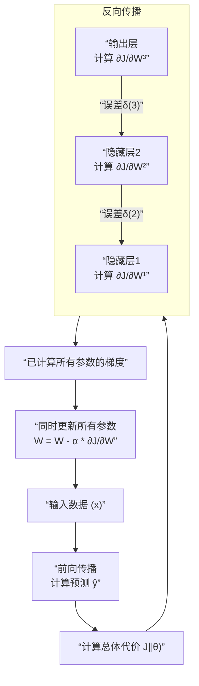

问得非常好！这是理解神经网络如何学习的核心关键。从单个节点（一个参数）扩展到整个网络（数百万个参数）的梯度下降，其核心机制就是**反向传播算法**。

我们可以把整个过程拆解成清晰的步骤。

### 一、核心直觉：责任分摊

想象一下，一个复杂项目出了错，经理要找出每个团队的责任有多大，从而指导他们如何改正。神经网络也是这样：

1.  **最终错误**由**代价函数 J** 衡量。
2.  这个错误是网络中**成千上万个参数（权重 W 和偏置 b）** 共同导致的。
3.  **梯度下降的目标**是：找出每个参数对最终错误应负的“责任”有多大（即梯度 ∂J/∂W 和 ∂J/∂b），然后根据这个责任大小来惩罚（减小）或奖励（增大）它。

**反向传播就是高效地、逐层地从输出层回溯到输入层，计算每个参数“责任”的过程。**

---

### 二、神经网络梯度下降的完整流程

下图直观地展示了一个神经网络进行梯度下降的完整过程，特别是反向传播如何将误差从输出层逐层传递回输入层：

让我们结合图示，详细讲解图中的每一步：

#### 第1步：前向传播 - 计算预测值
- 如上图所示，输入数据 `x` 从输入层流入，经过每一个隐藏层，最终到达输出层，得到预测值 `ŷ`。
- 在这个过程中，数据流经的每一步（每个神经元的加权和 `z` 和激活输出 `a`）都会被**缓存下来**，因为反向传播时需要用到它们。

#### 第2步：计算总体代价（损失）
- 将网络的批量预测 `ŷ` 与真实的标签 `y` 进行比较，通过代价函数 `J(θ)` 计算出总的误差。
- 这是我们想要**最小化**的最终目标。

#### 第3步：反向传播 - 核心中的核心
这是最关键的一步，目的是计算代价函数 `J` 对于网络中**每一个参数**（每一个权重 `W` 和偏置 `b`）的梯度（导数）。

**它的工作原理是链式法则，方向与前向传播相反：**

1.  **从输出层开始**：
    *   首先计算代价函数 `J` 对输出层加权输入 `z[L]` 的梯度。这个梯度通常表示为 `δ[L]`（L代表输出层），它代表了输出层神经元的“误差信号”。
    *   **计算输出层参数的梯度**：
        *   `∂J/∂W[L] = δ[L] · (a[L-1])ᵀ` （这里用到了前向传播中缓存下来的 `a[L-1]`）
        *   `∂J/∂b[L] = δ[L]`

2.  **将误差反向传播到前一隐藏层**：
    *   使用 `δ[L]` 和输出层的权重 `W[L]`，可以计算出前一隐藏层（第L-1层）的误差信号 `δ[L-1]`。
    *   `δ[L-1] = (W[L])ᵀ · δ[L] ⊙ g'(z[L-1])`
    *   其中 `⊙` 表示逐元素相乘，`g'` 是激活函数的导数。这里用到了前向传播中缓存下来的 `z[L-1]`。

3.  **重复过程**：
    *   如上图所示，一旦我们有了 `δ[L-1]`，我们就可以用同样的公式计算 `∂J/∂W[L-1]` 和 `∂J/∂b[L-1]`。
    *   这个过程逐层重复，将误差信号 `δ` 像接力棒一样从后向前传递，直到传播到第一层隐藏层。

#### 第4步：同时更新所有权重和偏置
- 在通过一次反向传播，计算完**所有参数**的梯度之后，我们才进行更新。
- 使用**梯度下降更新规则**同时更新网络中的**每一个**参数：
    *   `W = W - α · ∂J/∂W`
    *   `b = b - α · ∂J/∂b`
    *   其中 `α` 是学习率。

**请注意：** 我们是计算完所有梯度后再统一更新，而不是算一个就更新一个。

---

### 三、一个简单的比喻：多层生产线

想象一个汽车装配工厂：
*   **前向传播**：原材料（输入）经过生产线1（隐藏层1）、生产线2（隐藏层2），最终成为成品汽车（输出）。
*   **发现错误**：质检部门（代价函数）发现汽车有缺陷（误差）。
*   **反向传播（责任追溯）**：
    *   质检部门先告诉最后一条生产线2（输出层）：“你的错误程度是X，这是你用的零件（上一层输出）的问题，请调整你的装配手册（权重W²）。”
    *   生产线2根据这个信息，反过来告诉生产线1（隐藏层）：“你给我的零件有问题，这是你应有的责任程度Y。”
    *   生产线1再根据这个信息，调整自己的装配手册（权重W¹）。
*   **参数更新**：所有生产线**同时**根据自己收到的“责任报告”（梯度）来调整自己的装配手册（更新权重）。

---

### 四、与单节点梯度下降的联系

| 单参数梯度下降 | 神经网络梯度下降 |
| :--- | :--- |
| 1. 计算损失 | 1. **前向传播**计算所有输出和总代价 |
| 2. 计算梯度 ∂J/∂θ | 2. **反向传播**利用链式法则计算所有 ∂J/∂W 和 ∂J/∂b |
| 3. 更新参数 θ = θ - α·∂J/∂θ | 3. **同时更新**所有参数 W、b |

### 总结

神经网络梯度下降的精髓在于：

1.  **前向传播**：计算当前参数下的“答案”和“总误差”。
2.  **反向传播**：利用**链式法则**，高效地、自动化地将总误差**分摊**给网络中的每一个参数，计算出每个参数的梯度。这是一个动态的、基于微积分的过程。
3.  **同时更新**：所有参数根据自己对应的梯度同时进行更新。

反向传播的魅力在于，它通过一次前向传播和一次反向传播，就能计算出**数百万甚至数十亿**个参数的梯度，这使得训练极其复杂的深度学习模型成为可能。你不需要手动去推导每一个参数的梯度公式，框架（如TensorFlow/PyTorch）的自动微分功能会为你完成所有繁重的数学计算。