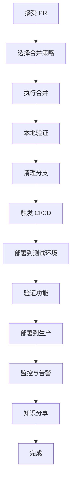

接受（合并）PR 后，需要执行一系列后续操作。以下是完整的 **PR 合并后工作流程**：

## 一、合并 PR 的几种方式

在合并前，你需要选择合适的合并策略：

### **1. 网页端合并（GitHub/GitLab）**
```markdown
点击 Merge pull request 按钮，有 3 种选项：
- **Create a merge commit**（推荐）：保留完整历史
  ```
  git merge --no-ff feature-branch
  ```
- **Squash and merge**：多个提交合并为 1 个
  ```
  git merge --squash feature-branch
  ```
- **Rebase and merge**：线性历史（GitLab 称 Fast-forward）
```

### **2. 命令行合并**
```bash
# 确保在主分支
git checkout main

# 更新主分支
git pull origin main

# 合并 PR 分支
git merge --no-ff pr-branch-name

# 或使用 squash（清理提交历史）
git merge --squash pr-branch-name
git commit -m "feat: 添加新功能 (#123)"

# 推送
git push origin main
```

### **3. 使用 GitHub CLI 合并**
```bash
# 查看 PR 状态
gh pr view 123

# 合并 PR
gh pr merge 123 --merge  # 或 --squash, --rebase

# 示例：合并并删除远程分支
gh pr merge 123 --merge --delete-branch

# 示例：使用 squash 合并
gh pr merge 123 --squash --body "合并 PR #123"

# 查看帮助
gh pr merge --help
```

## 二、合并后的立即操作

### **1. 验证合并结果**
```bash
# 检查最新提交
git log --oneline -5

# 查看合并提交
git show HEAD

# 验证构建
npm run build

# 运行测试确保合并没破坏功能
npm test

# 检查冲突解决是否正确
git status
```

### **2. 更新本地环境**
```bash
# 拉取最新的主分支
git checkout main
git pull origin main

# 如果使用功能分支开发，同步到你的分支
git checkout your-feature-branch
git rebase main
# 或
git merge main
```

### **3. 清理本地分支**
```bash
# 删除已合并的本地分支
git branch -d pr-branch-name

# 强制删除（如果还没完全合并）
git branch -D pr-branch-name

# 批量清理已合并的分支
git branch --merged main | grep -v "^\*" | xargs git branch -d

# 删除远程分支（通常 PR 页面有选项自动删除）
git push origin --delete pr-branch-name
```

## 三、代码合并后的团队协作

### **1. 通知团队成员**
```bash
# 在团队聊天工具中通知
# Slack/Teams/Discord 消息模板：
"""
🚀 PR #123 已合并到 main
变更：修复用户登录 bug
作者：@username
影响：所有用户登录相关功能
部署计划：今天下午 3 点
查看：https://github.com/org/repo/commit/abc123
"""
```

### **2. 更新项目文档**
```markdown
## CHANGELOG.md 更新示例

### [Unreleased]
#### Added
- 新功能：用户多因素认证 (#123)
- API 端点 `/api/v2/auth/mfa`

#### Fixed
- 修复登录时的 XSS 漏洞 (#123)
- 解决会话过期时间不正确的问题

---

## API_DOCS.md 更新
### 认证端点
- 新增 `POST /api/v2/auth/mfa`
  请求：`{ "token": "123456" }`
  响应：`{ "verified": true }`
```

### **3. 创建 Git 标签（如需要）**
```bash
# 为重要功能创建标签
git tag -a v1.2.0 -m "发布用户认证增强功能"
git push origin v1.2.0

# 或使用语义化版本
git tag -a v1.2.0-rc.1 -m "Release candidate for MFA feature"
```

## 四、部署与发布流程

### **1. 触发 CI/CD 流水线**
```yaml
# .github/workflows/deploy.yml 示例
name: Deploy
on:
  push:
    branches: [ main ]

jobs:
  deploy:
    runs-on: ubuntu-latest
    steps:
      - uses: actions/checkout@v3
      
      - name: Build and Test
        run: |
          npm ci
          npm test
          npm run build
          
      - name: Deploy to Staging
        if: github.ref == 'refs/heads/main'
        run: |
          echo "Deploying to staging..."
          # 部署命令
```

### **2. 环境部署顺序**
```mermaid
流程：
开发环境（自动） → 测试环境（手动） → 预生产环境 → 生产环境
```

```bash
# 手动触发部署到特定环境
# 使用部署工具或脚本
./deploy.sh --env staging
./deploy.sh --env production
```

### **3. 监控部署状态**
```bash
# 查看部署日志
kubectl get pods -n production
kubectl logs deployment/app-deployment

# 或查看云服务商控制台
# AWS/GCP/Azure 部署状态
```

## 五、验证生产环境

### **1. 健康检查**
```bash
# 测试生产环境 API
curl https://api.example.com/health
# 预期：{"status":"healthy","version":"1.2.0"}

# 测试新功能端点
curl -X POST https://api.example.com/api/v2/auth/mfa \
  -H "Authorization: Bearer token" \
  -d '{"code":"123456"}'
```

### **2. 监控指标**
```bash
# 查看错误率
# 使用监控工具：Datadog, New Relic, Prometheus

# 检查日志中的错误
grep "ERROR" production.log | tail -20

# 验证性能指标
# 响应时间、吞吐量、错误率
```

### **3. 用户反馈收集**
```markdown
## 创建反馈 issue
标题：验证新登录功能 v1.2.0
内容：
请测试团队验证以下功能：
1. [ ] 多因素认证设置
2. [ ] 登录流程
3. [ ] 错误处理
4. [ ] 移动端兼容性

报告问题到：#feedback 频道
```

## 六、后续维护任务

### **1. 问题追踪与修复**
```bash
# 如果发现问题，立即创建 hotfix
git checkout -b hotfix/login-issue
# 修复问题
git commit -m "fix: 修复登录 token 过期问题"
git push origin hotfix/login-issue

# 创建紧急 PR
gh pr create --title "紧急修复：登录问题" --body "问题描述..."
```

### **2. 回滚计划（如果需要）**
```bash
# 回滚到上一个稳定版本
git revert HEAD~1  # 撤销最新合并
# 或
git revert <merge-commit-hash>

# 创建回滚 PR
gh pr create --title "回滚：登录功能" --body "原因：生产环境问题"
```

### **3. 知识分享**
```markdown
## 团队内部分享
### 主题：新登录功能实现细节
时间：本周五 10:00
内容：
1. 技术架构变化
2. 测试要点
3. 运维注意事项
4. 故障排除指南

文档链接：Confluence/Notion 页面
```

## 七、自动化脚本示例

### **合并后自动化脚本**
```bash
#!/bin/bash
# post-merge.sh
# 自动执行合并后任务

PR_NUMBER=$1
PR_TITLE=$(gh pr view $PR_NUMBER --json title --jq '.title')

echo "🚀 处理 PR #$PR_NUMBER: $PR_TITLE"

# 1. 更新本地
git checkout main
git pull origin main

# 2. 运行测试
echo "运行测试..."
npm test

# 3. 更新 CHANGELOG
echo "更新 CHANGELOG..."
node scripts/update-changelog.js $PR_NUMBER "$PR_TITLE"

# 4. 通知团队
echo "通知团队..."
curl -X POST $SLACK_WEBHOOK \
  -d '{"text":"PR #'$PR_NUMBER' 已合并: '$PR_TITLE'"}'

# 5. 触发部署
echo "触发测试环境部署..."
gh workflow run deploy.yml --ref main
```

### **CHANGELOG 更新脚本**
```javascript
// scripts/update-changelog.js
const fs = require('fs');
const prNumber = process.argv[2];
const prTitle = process.argv[3];

const changelog = fs.readFileSync('CHANGELOG.md', 'utf8');
const today = new Date().toISOString().split('T')[0];

const newEntry = `\n### ${today}\n- ${prTitle} (#${prNumber})\n`;

// 在 ## [Unreleased] 部分添加
const updated = changelog.replace('## [Unreleased]', `## [Unreleased]\n${newEntry}`);
fs.writeFileSync('CHANGELOG.md', updated);
```

## 八、最佳实践清单

### **合并后检查清单**
```markdown
## ✅ PR 合并后检查清单

### 代码层面
- [ ] 所有 CI 检查通过
- [ ] 本地构建成功
- [ ] 测试覆盖率未下降
- [ ] 代码审查意见已处理
- [ ] 依赖库已更新（如有）

### 文档更新
- [ ] CHANGELOG 已更新
- [ ] API 文档已同步
- [ ] README 更新（如有接口变更）
- [ ] 迁移指南（如有破坏性变更）

### 部署验证
- [ ] 测试环境部署成功
- [ ] 健康检查通过
- [ ] 新功能测试通过
- [ ] 监控告警配置更新

### 团队沟通
- [ ] 相关团队已通知
- [ ] 客服/支持团队知晓变更
- [ ] 创建验证任务
- [ ] 安排知识分享
```

## 九、常见问题处理

### **1. 合并后发现问题**
```bash
# 立即创建修复分支
git checkout -b hotfix/issue-description

# 快速修复
# ...

# 创建紧急 PR
gh pr create --base main --title "紧急修复" --body "问题描述..."

# 使用 /urgent 标签加速审查
```

### **2. 需要部分回滚**
```bash
# 只回滚某个文件的变更
git checkout HEAD~1 -- path/to/file.js
git commit -m "revert: 部分回滚文件"

# 或使用 git revert 指定文件
git revert -n <commit>  # 不自动提交
git reset HEAD  # 取消所有暂存
git add path/to/keep.js  # 只添加要保留的文件
git commit -m "选择性回滚"
```

### **3. 依赖冲突**
```bash
# 更新 package.json 冲突
npm install  # 安装最新依赖
npm audit fix  # 修复安全问题

# 更新 lock 文件
rm package-lock.json
npm install

# 验证依赖
npm ls  # 查看依赖树
```

## 十、总结工作流



记住：**合并 PR 只是开始，不是结束**。良好的后续流程能确保代码质量、团队协作和生产稳定性。