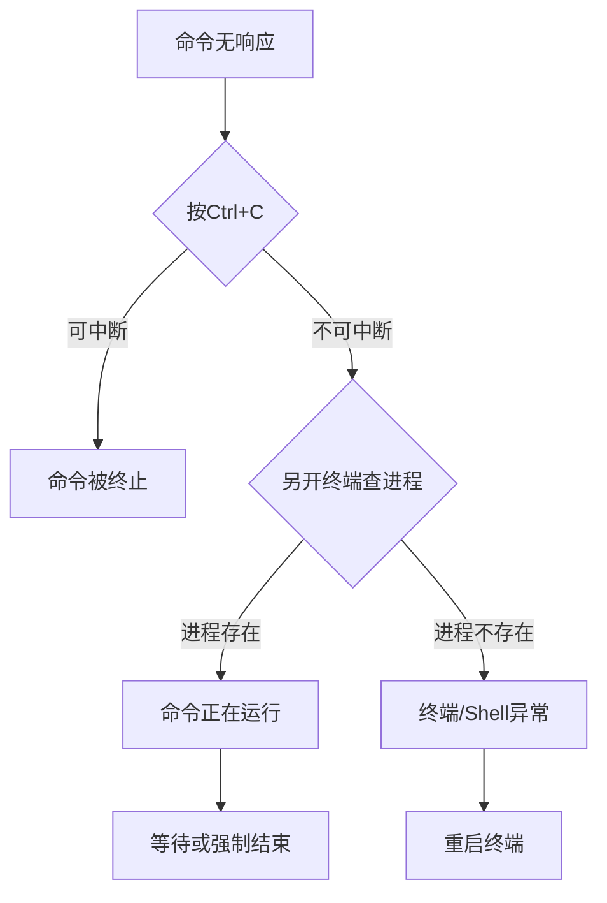

在 Linux Shell 中，输入命令后没有返回提示符 `$`（即 Shell 看似"卡住"），通常是由以下原因导致的：

---

### **1. 命令正在运行中**
- **现象**：命令需要长时间执行（如网络请求、大数据处理），Shell 在等待命令完成。
- **验证方法**：
  - 按 `Ctrl + Z` 暂停进程，用 `jobs` 查看后台任务。
  - 另开终端用 `top` 或 `htop` 观察进程状态。
- **解决**：
  - 等待执行完成。
  - 按 `Ctrl + C` 强制终止（如需中断）。

---

### **2. 命令等待用户输入**
- **常见命令**：
  - `ssh`：等待密码或确认。
  - `mysql`：进入交互式命令行。
  - `gpg`：等待输入密钥密码。
  - 未提供参数的脚本（如 `read` 命令）。
- **验证方法**：
  - 观察命令输出是否有提示（如 `Password:`）。
  - 按 `Enter` 或输入必要信息。
- **解决**：
  - 补全输入后继续。
  - 按 `Ctrl + C` 退出。

---

### **3. 命令被挂起（如网络阻塞）**
- **典型场景**：
  - `ping` 未指定次数（`ping example.com`）。
  - `telnet`/`nc` 连接无响应的服务。
- **解决**：
  - 按 `Ctrl + C` 中断。
  - 运行时添加超时选项（如 `ping -c 4 example.com`）。

---

### **4. Shell 进程异常**
- **可能原因**：
  - Shell 崩溃（如内存不足）。
  - 终端模拟器故障。
- **验证方法**：
  - 按 `Ctrl + C` 无反应时，尝试 `Ctrl + D`（发送 EOF）。
  - 另开终端用 `ps aux | grep $USER` 检查进程。
- **解决**：
  - 关闭当前终端，重新打开。
  - 用 `kill -9 <PID>` 结束异常进程。

---

### **5. 输出缓冲区未刷新**
- **常见于**：Python/Ruby 等脚本未显式刷新输出。
- **验证方法**：
  - 按 `Enter` 可能触发刷新。
  - 命令后加 `; echo` 强制换行。
- **解决**：
  - 修改脚本添加输出刷新（如 Python 的 `sys.stdout.flush()`）。
  - 用 `stdbuf -oL <command>` 运行命令（禁用缓冲）。

---

### **6. 终端显示问题**
- **现象**：命令已结束，但提示符未显示（可能被隐藏）。
- **验证方法**：
  - 输入 `reset` 或 `echo $PS1` 重置终端。
  - 按 `Ctrl + L` 清屏。
- **解决**：
  - 关闭终端重开。
  - 检查 `$PS1` 环境变量是否被修改。

---

### **快速诊断步骤**
1. **按 `Ctrl + C`** → 尝试中断当前命令。
2. **按 `Ctrl + D`** → 发送 EOF（可能退出交互式程序）。
3. **检查进程** → 另开终端运行：
   ```bash
   ps aux | grep <command>  # 查看命令是否仍在运行
   ```
4. **终端测试** → 输入 `echo hello` 看是否有响应。

---

### **预防措施**
- 运行长时间命令时，用 `&` 放到后台：
  ```bash
  long_running_command &
  ```
- 添加超时限制：
  ```bash
  timeout 10s slow_command  # 10秒后自动终止
  ```
- 使用 `nohup` 防止 SSH 断开导致中断：
  ```bash
  nohup command > output.log &
  ```

---

### **总结流程图**


遇到此类问题时，优先检查命令是否在后台运行，再逐步排查终端状态。