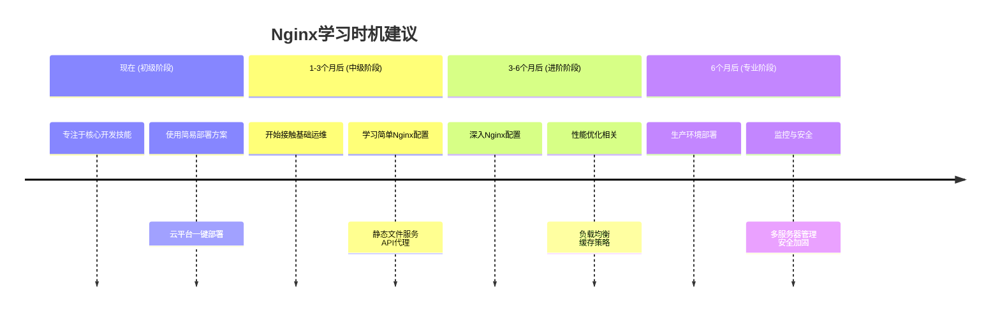

## 🤔 **Nginx是什么？**

**Nginx**（发音为"engine-x"）是一个高性能的**Web服务器**和**反向代理服务器**。简单来说，它就像是网站的"交通警察"或"接待员"。

### **Nginx主要做什么？**
```
1. 接收用户请求 → 2. 决定交给谁处理 → 3. 返回结果给用户
```

### **Nginx的核心功能：**
| 功能 | 说明 | 举例 |
|------|------|------|
| **静态文件服务** | 快速提供HTML、CSS、JS等文件 | 访问 `yourdomain.com` 显示首页 |
| **反向代理** | 把请求转发给后端应用服务器 | 将 `/api` 的请求转给Node.js |
| **负载均衡** | 将流量分配到多个服务器 | 3台服务器轮流处理请求 |
| **SSL/TLS终结** | 处理HTTPS加密 | 将HTTP转为HTTPS |
| **缓存** | 缓存内容加快响应速度 | 缓存图片减少服务器压力 |

## 📊 **我需要学Nginx吗？**

### **分析你的情况：**

**你现在的情况：**
- ✅ 前端：React + Vite
- ✅ 后端：Express
- 🔄 部署：正在学习

### **学习建议时间线：**



### **什么时候学Nginx？**

#### **第一阶段：现在（跳过Nginx）**
✅ **适合你当前水平**：使用云平台的简易部署
```bash
# 前端部署到Vercel（一键部署）
npm run build
# 然后拖拽dist文件夹到Vercel

# 后端部署到Railway（同样简单）
# 1. 连接GitHub仓库
# 2. Railway自动部署
```

**理由**：
- 学习成本低
- 无需服务器管理
- 专注写代码而不是运维

#### **第二阶段：1-3个月后（了解基础）**
📚 **学习简单配置**：
```nginx
# 只需要学会这个基础配置就够用很长时间
server {
    listen 80;
    server_name yourdomain.com;
    
    # 前端文件
    location / {
        root /var/www/frontend;
        index index.html;
        try_files $uri $uri/ /index.html;
    }
    
    # 代理到后端
    location /api {
        proxy_pass http://localhost:5000;
    }
}
```

#### **第三阶段：3-6个月后（深入学习）**
🎯 **当你需要时再深入学习**：
- 项目需要HTTPS证书
- 有多个后端服务需要代理
- 需要性能优化（缓存、压缩）
- 流量增长需要负载均衡

## 🚀 **不同阶段的部署方案对比**

### **方案A：初学者方案（现在就用这个）**
```bash
# 前端：Vercel
# 后端：Railway
# 数据库：MongoDB Atlas
# 总成本：$0
# 配置时间：10分钟
```

**优点**：
- 完全免费（有使用限制但足够学习）
- 无需配置服务器
- 自动HTTPS
- 自动CI/CD

### **方案B：中级方案（1-3个月后考虑）**
```bash
# 服务器：DigitalOcean $5/月
# 安装：Nginx + Node.js
# 部署：PM2管理进程
# 配置时间：1-2小时
```

### **方案C：专业方案（6个月后考虑）**
```bash
# 多服务器 + 负载均衡
# Docker容器化
# CI/CD流水线
# 监控告警系统
```

## 🎯 **具体建议学习路径**

### **Week 1-4：完成第一个项目并部署**
```javascript
// 目标：Todo应用
// 技术栈：React + Express + MongoDB
// 部署：Vercel + Railway
// 完全不需要Nginx
```

### **Month 2-3：接触基础Nginx**
**只需掌握**：
1. 安装Nginx
2. 基础配置语法
3. 静态文件服务
4. 反向代理
5. 重启Nginx服务

**实践项目**：
```bash
# 在本地虚拟机或便宜的VPS上练习
# 1. 安装Nginx
sudo apt update
sudo apt install nginx

# 2. 配置站点
sudo nano /etc/nginx/sites-available/my-site

# 3. 上传你的前端build文件
# 4. 启动你的Express后端
# 5. 配置Nginx代理
```

### **Month 4-6：学习Docker**
**更现代的选择**：
```dockerfile
# 用Docker Compose管理所有服务
version: '3.8'
services:
  nginx:
    image: nginx:alpine
    ports:
      - "80:80"
      - "443:443"
    volumes:
      - ./nginx.conf:/etc/nginx/nginx.conf
      - ./frontend/dist:/usr/share/nginx/html
      
  backend:
    build: ./backend
    environment:
      - NODE_ENV=production
```

## 📝 **Nginx核心概念速记**

```nginx
# 最简单的配置模板（保存备用）
server {
    listen 80;
    server_name 你的域名.com www.你的域名.com;
    
    # React前端（支持前端路由）
    location / {
        root /var/www/你的项目/dist;
        index index.html;
        try_files $uri $uri/ /index.html;
    }
    
    # 代理到Express后端
    location /api {
        proxy_pass http://localhost:3000;
        proxy_set_header Host $host;
        proxy_set_header X-Real-IP $remote_addr;
    }
    
    # 静态文件缓存优化
    location ~* \.(jpg|jpeg|png|gif|ico|css|js)$ {
        expires 1y;
        add_header Cache-Control "public, immutable";
    }
}
```

## 💡 **给你的最终建议**

1. **现在不要学Nginx** - 先用Vercel+Railway部署，专注React和Express
2. **1个月后** - 完成2-3个全栈项目，熟悉完整开发流程
3. **3个月后** - 花一个周末学习Nginx基础，在便宜的VPS上实践
4. **优先学习**：React高级特性 > Express中间件 > 数据库 > Docker > Nginx

**记住**：作为Web开发者，你的核心价值是**构建应用**，而不是配置服务器。Nginx只是工具之一，在需要时学习即可。

你现在最想构建什么类型的项目？我可以给你具体的实现方案，包括不需要Nginx的部署方法。