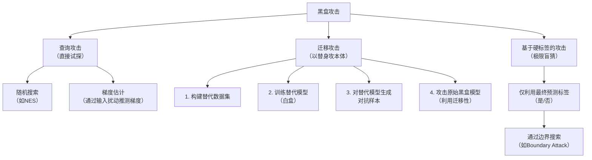

当然！作为信息安全专业的学生，理解黑盒攻击会让你有“这才是真实黑客操作”的感觉。黑盒攻击是现实中更可能发生的攻击场景，因为它**无需知道模型内部细节**，非常贴合你的专业背景。

### 一、核心思想：把模型当成一个“黑盒子”

想象你面前有一个神秘的保险箱（模型）。你不知道它的内部构造（网络结构、参数），但你**可以不停地尝试密码（输入数据），并观察它是否打开（输出结果）**。你的目标就是通过这种“试错”，找到能打开它的密码（对抗样本）。

### 二、主要攻击方法分类与详解

黑盒攻击主要分为三大流派，下图清晰地展示了它们之间的关系和核心思路：

#### 流派一：查询攻击 —— “盲人摸象，不断试探”

攻击者直接向黑盒模型发起大量查询，通过观察输入-输出的对应关系，来反推如何构造对抗样本。这是最直观的黑盒攻击。

**1. 基于随机搜索的方法**
*   **思路**：像一个无头苍蝇，但在聪明的策略指导下乱撞。
*   **代表算法**：**NES（自然进化策略）**
*   **工作原理**：
    1.  初始化一个随机噪声。
    2.  在噪声周围采样多个小的扰动样本。
    3.  将这些扰动样本输入黑盒模型，得到它们对应的损失值（置信度分数）。
    4.  根据损失值的好坏，决定下一次噪声更新的方向（朝着让损失增大的方向进化）。
    5.  重复步骤2-4，直到找到成功的对抗样本。
*   **优点**：只需要模型输出的**置信度分数**（如Softmax概率），不需要梯度。
*   **缺点**：查询次数可能非常多，效率较低。

**2. 基于梯度估计的方法**
*   **思路**：既然拿不到真实的梯度，我就用数学方法“猜”出梯度的大致方向。
*   **代表思想**：**有限差分法**
*   **工作原理**：
    1.  给定一个原始图片，想知道某个像素点变化对结果的影响。
    2.  轻微改变这个像素点的值（+ε），查询一次模型，得到损失值L1。
    3.  再轻微向反方向改变（-ε），再查询一次，得到损失值L2。
    4.  用公式 `(L1 - L2) / (2ε)` 来近似这个像素点的梯度。
    5.  对所有像素或重要像素进行估算，就能得到近似的梯度图，然后就可以像白盒攻击（如FGSM）一样生成对抗样本。
*   **优点**：思路直接，是白盒攻击思想的延伸。
*   **缺点**：估算一个像素就需要2次查询，估算整张图的梯度查询成本巨大。

#### 流派二：基于迁移的攻击 —— “训练一个替身来打本体”（最常见、最实用）

这是目前**最主流、最有效**的黑盒攻击方法，完美结合了你的机器学习和安全知识。

*   **核心直觉**：对抗样本具有**可迁移性**。针对模型A生成的对抗样本，经常也能欺骗结构或数据相似的模型B。
*   **攻击流程**（对应上图的流程）：
    1.  **探知与收集**：攻击者向黑盒模型输入一些数据（可以是公开数据集，或自己构造的数据），收集其输入-输出对 `(输入, 预测标签)`。这不需要任何内部信息。
    2.  **训练替代模型**：用这些收集到的 `(输入, 输出)` 数据，本地训练一个自己的模型（替代模型）。目标是让这个替代模型在行为上尽可能模仿黑盒模型。
    3.  **白盒攻击替代模型**：因为替代模型是完全受控的（白盒），攻击者可以使用任何强大的白盒攻击方法（如PGD、CW攻击）来生成对抗样本。
    4.  **发动攻击**：将这些针对替代模型生成的对抗样本，直接输入到原始的黑盒模型中。凭借对抗样本的迁移性，有很大概率攻击成功。
*   **优点**：
    *   前期需要一定查询来收集数据，但一旦替代模型训练好，生成对抗样本的成本极低。
    *   非常贴近现实。很多在线AI服务（如人脸识别API、内容审核API）的输出本身就是标签，很容易被收集。
*   **这正体现了你之前学的“博弈论”**：防御者不知道攻击者本地在用什么“替身模型”进行模拟训练，形成了一个不对称的信息博弈。

#### 流派三：基于决策边界的攻击 —— “我只知道对或错”

这是**限制最严格、也最 stealthy（隐蔽）** 的黑盒攻击。攻击者只能获得模型的最终**硬标签**（例如，只返回“这是猫”或“这是狗”，而不返回是猫的概率为90%）。

*   **思路**：像在黑暗里只靠触觉摸索一道墙的边界。
*   **代表算法**：**Boundary Attack（边界攻击）**
*   **工作原理**：
    1.  从一个**已知的**、被**错误分类**的样本开始（例如，一个明显是“狗”但被模型判为“猫”的噪声图片）。
    2.  进行迭代：在每一步， proposed 一个小的扰动。
    3.  核心检查：如果扰动后的样本**仍然被模型误分类**（例如，还是“猫”），就接受这个扰动，向真实图片靠近一步；如果扰动后样本被**正确分类**了（变回了“狗”），就拒绝这个扰动，换个方向。
    4.  反复进行，这个样本就会像“贪吃蛇”一样，沿着分类边界，从一个错误分类的区域，“爬行”到真实图片附近，同时始终保持被误分类的状态。最终得到的，就是一张看起来像真实图片、但会被模型误判的对抗样本。
*   **优点**：只需要最终的分类标签，信息量最小，最难被防御系统检测（因为不依赖概率泄露）。
*   **缺点**：通常需要非常大量的查询（上万次甚至更多），速度慢。

### 三、给你的实践建议与联系

1.  **从“迁移攻击”开始实践**：这是理解黑盒攻击精髓的最佳切入点。你可以：
    *   用PyTorch训练一个简单的CNN模型作为“受害者模型”。
    *   用不同的架构（如MLP）训练一个“替代模型”。
    *   对替代模型进行PGD白盒攻击，生成对抗样本。
    *   测试这些样本对受害者模型的攻击成功率。你会直观感受到“迁移性”的威力。

2.  **与信息安全思维结合**：
    *   黑盒攻击本质上就是**渗透测试**。你把目标AI模型看作一个存在潜在漏洞的系统，通过有限的信息接口（API）对其进行漏洞挖掘和利用。
    *   **模糊测试**：随机搜索类攻击就是一种针对AI模型的模糊测试。
    *   **信息泄露**：基于查询的攻击，其效率高度依赖于模型输出泄露的信息量（是概率向量还是硬标签）。这引出了**隐私保护**的问题。

3.  **前沿方向**：现在更热的方向是**对超大模型（LLM）的黑盒攻击**，例如通过精心设计的Prompt（提示词）来让ChatGPT等模型输出有害内容或泄露隐私。这被称为“Prompt Injection”攻击，你可以关注。

理解了黑盒攻击，你就掌握了对抗样本在现实世界中最锋利的矛。下一步，你可以思考：作为防御者，如何检测和抵御这种“看不见内部”的攻击？这又会引向全新的挑战。