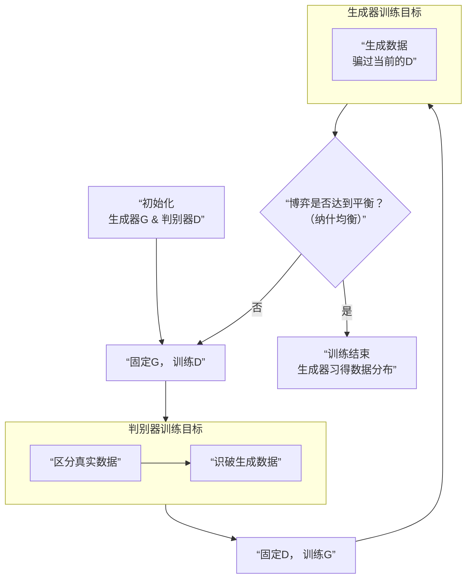

GAN（生成对抗网络）的本质是一场**动态的、不断进化的“伪造”与“甄别”的博弈**。它不是一个单一的模型，而是一个由两个神经网络（生成器G和判别器D）组成的竞技系统。

为了让你直观地理解这场博弈的整个过程，请看下面的流程图，它描绘了GAN从初始化到训练收敛的核心循环：

### 🎭 核心博弈：造假者 vs. 鉴宝专家

这个循环体现了GAN最精妙的思想，我们可以用一个生动的比喻来理解图中每个角色的目标：

*   **生成器**：是一个**造假者**。它的目标是学习真实数据的分布，并生成以假乱新的样本（如假画、假照片）。在图中，它不断更新自己，只为了能骗过当前版本的判别器。
*   **判别器**：是一个**鉴宝专家**。它的目标是尽力区分输入的数据是来自真实世界还是生成器伪造的。在图中，它也在不断学习，努力识破生成器的最新伎俩。

它们两者的关系，完美对应了你之前学过的 **“纳什均衡”**：
*   开始时，造假者技术拙劣，专家一眼就能识破。
*   但因为专家会把他鉴别的经验（梯度反馈）透露给造假者，造假者就据此改进技术。
*   造假者技术进步后，专家也必须学习新的鉴别知识才能保持水平。
*   如此循环往复，直到达到一个平衡点：**造假者造出的东西逼真到专家也无法区分（即判别器判断真假的概率始终接近50%）。此时，生成器就学会了真实数据的本质规律。**

### 📊 形式化定义与目标

用数学语言描述，GAN是一个**极小极大博弈**，其价值函数 V(G, D) 为：

**min_G max_D V(D, G) = E_{x~p_data(x)}[log D(x)] + E_{z~p_z(z)}[log(1 - D(G(z)))]**

*   **判别器D的目标（max）**：最大化这个函数。即，对于真实数据x，D(x)要尽可能大（判为真）；对于生成数据G(z)，D(G(z))要尽可能小（判为假）。
*   **生成器G的目标（min）**：最小化这个函数。即，要让自己生成的数据G(z)能使得D(G(z))尽可能大（让判别器判为真）。

双方通过交替优化，共同提升，直至达到均衡。

### 🔗 与你的研究领域的深刻联系

理解GAN的本质，对你研究对抗样本至关重要：

1.  **GAN本身就是一个对抗过程**：它为你提供了研究“攻击-防御”动态博弈的**绝佳模型**。生成器是“攻击者”，判别器是“防御者”，它们的对抗训练本身就是对抗机器学习最直接的体现。
2.  **GAN是强大的攻击武器**：正如我们之前讨论的**AdvGAN**，生成器可以被专门训练来生成对抗样本。这种攻击方式不再是“添加微小扰动”，而是“从零开始创造攻击样本”，更隐蔽、更强大。
3.  **GAN可用于防御**：生成器可以用于数据增强，生成更多样的训练样本，或者模拟难以获取的对抗样本，从而提升模型的鲁棒性（即**对抗训练**的数据来源之一）。
4.  **共享核心弱点**：无论是分类器还是GAN的判别器，它们都基于相似的神经网络架构。因此，它们共享类似的**脆弱性**——都对输入空间那些精心构造的、人类难以察觉的方向（对抗方向）高度敏感。攻击判别器同样可以使GAN系统崩溃。

### 💎 总结

GAN的本质不是一个静态的函数逼近器，而是一个**动态的、自我驱动的博弈系统**。它的目的不是判别，而是创造。这种通过“左右互搏”来学习数据本质规律的思想，是深度学习领域最闪耀的灵感之一。对于你——一位研究对抗样本的安全研究者——深入理解这场博弈，就等于掌握了攻防最核心的哲学。