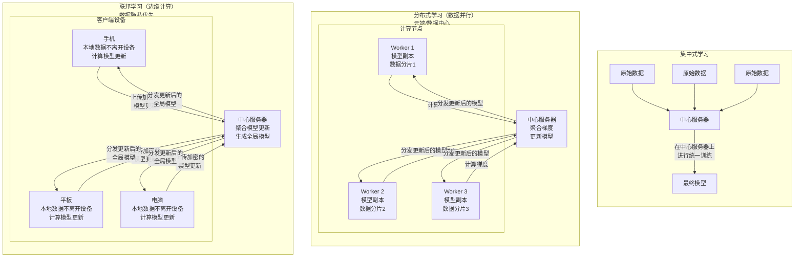

好的，这是一个非常核心的概念。简单来说：

**分布式学习** 是一种机器学习范式，它将模型训练任务**拆分**，并分配到**多个计算节点（工人）** 上同时进行，最终协作完成一个统一的训练目标。

它的核心思想是 **“分而治之”**。

为了更好地理解，我们可以将它与您刚才问的**联邦学习**，以及传统的**集中式学习**进行对比。

---

### 分布式学习的核心原理与分类

分布式学习主要解决两个问题：
1.  **数据太大**，单个机器存不下或算得慢。
2.  **模型太大**，单个机器无法承载。

据此，分布式学习主要有两种并行范式：

#### 1. 数据并行
这是最常见的形式。
*   **做法**：每个计算节点都拥有**完整的模型副本**，但处理**不同的数据分片**。每个节点计算完自己数据的梯度后，需要进行**同步聚合**，来更新一个统一的模型。
*   **目标**：**加快训练速度**。
*   **例子**：在拥有100万张图片的数据集上训练ResNet模型。如果有4台GPU服务器，就可以把100万张图片分成4份，每台服务器用25万张图片同时计算梯度。

#### 2. 模型并行
*   **做法**：将一个大模型**拆分**成几个部分，分别放置在不同的计算节点上。数据需要在这些节点间流动，依次经过模型的各个部分。
*   **目标**：**训练单个机器无法容纳的超大模型**。
*   **例子**：训练一个拥有1000亿参数的巨型语言模型，单个GPU的显存放不下。我们可以把模型的前几层放在GPU 1上，中间几层放在GPU 2上，最后几层放在GPU 3上。

---

### 分布式学习 vs. 集中式学习 vs. 联邦学习

这三种方式的核心区别在于 **数据和计算的分布方式**。下图清晰地展示了三者的架构差异：

为了更精确地把握它们之间的区别，下表从多个维度进行了对比：

| 维度 | 集中式学习 | 分布式学习（典型数据并行） | 联邦学习 |
| :--- | :--- | :--- | :--- |
| **数据位置** | 单一中心服务器 | **单个数据中心内**的多个计算节点 | **成百上千的分散终端设备**（手机、医院等） |
| **数据分布** | - | 通常假设为**独立同分布**，便于拆分 | **非独立同分布**，每个设备的数据分布差异很大 |
| **网络环境** | 高速局域网 | 高速局域网、数据中心网络 | **不稳定、低速的广域网**（如Wi-Fi、4G/5G） |
| **主要目标** | 处理小规模数据 | **加速训练、处理大数据/大模型** | **保护数据隐私、打破数据孤岛** |
| **系统假设** | - | 节点**可靠、稳定、同构** | 节点**不可靠、易掉线、异构** |
| **通信内容** | - | **梯度**（密度高、量级大） | **模型更新**（或梯度，通常需压缩和加密） |

---

### 总结

*   **分布式学习** 是一个**广义概念**，泛指任何通过多个计算单元协作进行训练的方式。它的核心驱动力是**性能与规模**。
*   **联邦学习** 是分布式学习的一种**特殊形式**，它更侧重于**隐私保护**，并在网络、数据、设备特性上都面临更严峻的挑战。可以说，**联邦学习是考虑了隐私、异构和通信效率的分布式学习**。

简单打个比方：
*   **集中式学习**：所有工人在一个车间里，围着同一堆材料干活。
*   **分布式学习**：一个工厂里有多个车间（计算节点），每个车间都有完整的生产线（模型副本），加工不同的原材料（数据分片），但由一个总厂长（中心服务器）统一指挥和协调。
*   **联邦学习**：很多工人在自己家里（终端设备），用自己的工具和材料（本地数据）按照统一的图纸（模型）加工零件，只把加工心得（模型更新）汇报给总部，总部汇总后改进图纸再下发。**原材料始终不离开各自的家**。