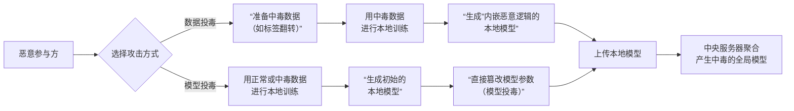

这是一个非常核心的问题。虽然“数据投毒”和“模型投毒”的最终目标都是破坏联邦学习的全局模型，但它们的**攻击原理、实施环节和技术手段有本质区别**。

我们可以用一个简单的比喻来理解：

*   **数据投毒**：像一个**食品造假商**。他使用劣质、有毒的原材料（中毒数据）进行生产（本地训练），生产出的产品（本地模型）本身“看起来正常”但“内含毒素”。当这些产品被汇总到总厂（中央服务器）时，最终出厂的商品（全局模型）就出了问题。
*   **模型投毒**：像一个**直接在生产线上搞破坏的工人**。他可能领到的是正常的原材料（干净数据），但在生产（本地训练）结束后，他直接在产品（本地模型）上**动手脚**，比如篡改配方参数，然后再上交。总厂在不知情的情况下聚合了这个被恶意篡改的产品，导致最终商品失效。

---

### 核心差别对比

为了更清晰地展示二者的区别，我整理了下面的对比表格和示意图：

#### 对比表格

| 维度 | **数据投毒攻击** | **模型投毒攻击** |
| :--- | :--- | :--- |
| **攻击目标** | 污染训练数据的源头 | 直接篡改训练后的模型参数 |
| **攻击原理** | 在**本地训练前**，伪造或篡改**训练数据**（如给数据加错误标签-标签翻转，或插入后门触发器）。然后用这些“毒数据”训练出一个“内嵌了恶意逻辑”的本地模型。 | 在**本地训练后、上传前**，直接**篡改本地模型的参数**（如梯度或权重）。这个被篡改的模型本身可能就不是用正常数据诚实训练得出的。 |
| **恶意载体** | **训练数据集** | **本地模型参数/更新** |
| **隐蔽性** | 相对较高。因为本地训练过程本身是符合规则的，产生的模型更新是“诚实计算”的结果，只是基于错误的前提。 | 相对较低。恶意方可能会上传一个与正常模型差异巨大的更新，容易被基于距离或相似性的异常检测机制发现。 |
| **攻击效率** | 通常较低。需要毒数据在本地训练中能有效影响模型，且经过聚合后被稀释，可能需要多个攻击周期。 | **通常非常高**。攻击者可以直接、精确地操纵模型参数，使其对全局模型产生立竿见影的破坏性影响。 |
| **技术难度** | 相对较低，只需构造毒数据即可。 | 相对较高，需要了解模型结构和聚合算法，才能有效篡改参数以实现攻击目标而不被轻易发现。 |
| **文档中例子** | - Gonzalez：用中毒样本训练影响梯度。 - Jiang：在目标函数中添加参数。 - Tolpegin：标签翻转攻击。 | - 文献[81-82]：直接修改本地模型后上传，攻击效果更明显。 |

#### 攻击流程图

以下流程图清晰地展示了两种攻击在联邦学习流程中的不同发生阶段：

---

### 为什么模型投毒通常比数据投毒更有效？

正如你文档中提到的，文献指出模型投毒攻击效果更明显。原因如下：

1.  **直接性与精确性**：数据投毒是一种“间接”攻击，毒数据对模型的影响需要通过训练过程来体现，这个过程存在不确定性。而模型投毒是“直接”攻击，攻击者可以精确计算并注入他们想要的恶意参数，攻击目标准确。
2.  **攻击力度强**：攻击者可以不顾物理约束（比如数据本身的分布），直接上传一个被恶意放大或精心构造的模型更新，这个更新的“力量”可以远远超过一个诚实训练出来的模型更新，从而在聚合时占据主导地位。
3.  **难以通过数据验证防御**：服务器可以通过一些技术（如差分隐私）来保护数据隐私，但很难判断一个模型更新本身是否是“恶意”的，只要它看起来像是一个有效的梯度更新。

**总结一下：**

- **数据投毒**是“下毒于源头”，攻击的是**训练输入**。
- **模型投毒**是“伪造于结果”，攻击的是**训练输出**。

由于模型投毒能更直接、更强力地操控联邦学习过程，因此它被认为是比数据投毒更严峻的安全威胁。理解这两者的区别，对于设计针对性的防御方案（如 robust aggregation, 异常检测）至关重要。