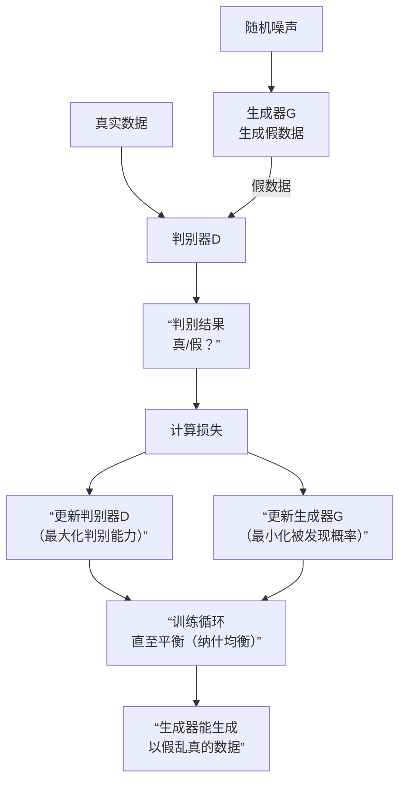

好的，我们来全面地介绍一下**生成对抗网络**——这个深度学习领域最有趣、最强大的概念之一。

### 核心思想：一场“猫鼠游戏”

GAN的核心思想非常巧妙，它源于一个**博弈论**的比喻：**伪造者** 和**鉴别者** 之间的对抗。

*   **伪造者**：他的目标是不断学习如何制造**逼真的假画**（生成假数据）。
*   **鉴别者**：他的目标是不断学习如何**分辨一幅画是真迹还是赝品**（鉴别数据真伪）。

在这场游戏中：
1.  伪造者努力提升技艺以骗过鉴别者。
2.  鉴别者因为见到更多高超的赝品，鉴赏能力也随之提升。
3.  这个过程循环往复，直到**伪造者的技艺变得出神入化，他制作的赝品逼真到鉴别者无法区分**。

---

### 架构与工作原理

GAN由两个独立的神经网络构成，它们被组合在一个零和游戏中。

#### 1. 生成器

*   **目标**：学习将随机噪声映射为逼真的数据（如图像、文本）。它的目标就是**骗过判别器**。
*   **输入**：一个随机的噪声向量（可以理解为一种“创意种子”）。
*   **输出**：一张伪造的图片（或任何目标类型的数据）。
*   **训练过程**：它根据判别器提供的反馈（“这张图是假的”）来调整自己的参数，学习如何生成越来越逼真的图片。

#### 2. 判别器

*   **目标**：学习区分**真实数据**和**生成器产生的假数据**。
*   **输入**：一张图片（可能来自真实数据集，也可能来自生成器）。
*   **输出**：一个概率值（0到1之间），表示该图片是真实图片的置信度（例如，1代表真，0代表假）。
*   **训练过程**：它同时观看真实图片和生成器产生的假图片，并学习找出它们之间的细微差别，更新自己的参数以提升鉴别能力。

#### 训练过程的“迷你最大博弈”

整个训练过程可以概括为生成器（G）和判别器（D）之间的优化竞争，其目标函数如下：

\[ \min_G \max_D V(D, G) = \mathbb{E}_{x \sim p_{data}(x)}[\log D(x)] + \mathbb{E}_{z \sim p_z(z)}[\log(1 - D(G(z)))] \]

这个公式看起来复杂，但理解起来很简单：
*   **判别器（D）想最大化这个函数**：
    *   它希望对于真实图片 `x`，`D(x)` 接近 1（判断为真）。
    *   它希望对于生成图片 `G(z)`，`D(G(z))` 接近 0（判断为假）。
*   **生成器（G）想最小化这个函数**：
    *   它希望判别器对生成图片的判断 `D(G(z))` 接近 1（即骗过判别器，让它误以为是真的）。

这个过程可以用下面的流程图来动态展示，它清晰地揭示了你追我赶的对抗本质：

---

### GAN的主要特点

**优势：**
1.  **生成质量高**：产生的数据，尤其是图像，通常非常清晰、逼真。
2.  **无需显式建模**：它直接学习数据的分布，而不需要复杂的概率模型假设。
3.  **想象力丰富**：能够创造出训练数据中不存在的、但符合数据分布的新样本。

**挑战与劣势：**
1.  **训练不稳定**：著名的“训练难”问题。生成器和判别器的平衡非常微妙，容易一方压倒另一方（例如判别器太强，导致生成器学不到东西）。
2.  **模式崩溃**：生成器可能发现只生成一种或少数几种能骗过判别器的样本，然后开始“偷懒”，反复生成这些样本，缺乏多样性。
3.  **评估困难**：没有完美的指标来衡量生成模型的好坏，常用但仍有缺陷的指标是IS和FID。

---

### 主要应用领域

GAN的应用极其广泛，以下是一些著名例子：

1.  **图像生成**：生成不存在的人脸、动物、艺术品等。
2.  **图像到图像的转换**：
    *   **风格迁移**：将照片变成梵高画作风格。
    *   **着色**：将黑白照片变成彩色。
    *   **语义分割图→照片**。
3.  **图像超分辨率**：将低分辨率图像放大并增强为高分辨率图像。
4.  **数据增强**：为稀缺的训练类别生成新样本。
5.  **文本到图像生成**：根据文字描述生成对应的图像。
6.  **隐私保护**：生成合成的医疗数据用于研究，而不泄露真实病人信息。

**总结来说，GAN通过一种优雅的对抗性训练机制，让两个神经网络在相互博弈中共同进化，最终赋予机器“创造”逼真数据的能力。它不仅是深度学习皇冠上的一颗明珠，也正在成为推动AI内容生成发展的核心引擎之一。**