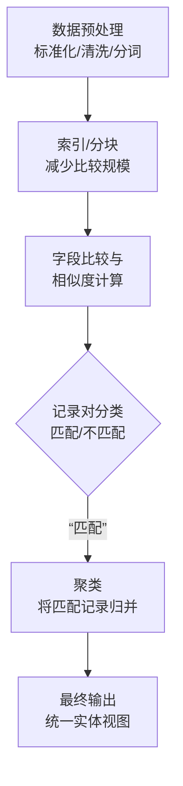

好的，我们来深入讲解实体解析的具体技术和流程。这部分是理论和实践的结合点，非常关键。

实体解析，也称为记录链接或数据匹配，其核心目标是**从多个数据源中识别出指向现实世界同一实体的记录**。

### 实体解析的基本流程

一个标准的实体解析流程包含以下步骤，我们可以通过一个清晰的流程图来概览其全貌，然后再深入每个环节的细节：

---

#### 第1步：数据预处理

这是基础且至关重要的一步，目的是将杂乱的数据标准化，为后续比较打下基础。
*   **标准化**：
    *   **大小写**：将“New York”和“NEW YORK”都转为“new york”。
    *   **格式**：将电话号码“(123) 456-7890”统一为“1234567890”。
    *   **单位**：将“5kg”和“5000g”统一为“5000”。
*   **清洗**：
    *   纠正拼写错误，如“Amaz0n” -> “Amazon”。
    *   移除停用词、标点符号，如“The Big Apple Corp.” -> “Big Apple Corp”。
*   **分词**：
    *   将地址“123 Main St, NYC”拆分为令牌：["123", "main", "st", "nyc"]。

#### 第2步：索引/分块

如果不加处理，直接进行所有记录之间的两两比较，其计算复杂度是O(n²)，对于大数据集是不可行的。索引的目的是**减少需要比较的记录对数量**。
*   **分块**：只比较在某个“块”或“键”下相同的记录。
    *   **示例**：只比较“邮编”相同的记录。这样，纽约的记录就不用和北京的记录比较了。
*   **更高级的索引**：
    *   **排序邻居索引**：按名称的拼音排序，只比较滑动窗口内的记录。
    *   ** canopy聚类**：使用一种快速、粗略的相似度方法（如Jaccard相似度）先进行预聚类，然后在每个Canopy内进行精细比较。

#### 第3步：字段比较与相似度计算

这是核心步骤，用于量化两条记录的相似程度。
*   **字符串相似度度量**：
    *   **编辑距离**：将一个字符串转换为另一个字符串所需的最少编辑操作次数。适用于短文本，如姓名。
    *   **Jaccard相似度**：比较两个集合（如分词后的令牌集合）的交集与并集的比例。适用于地址、产品名称等。
    *   **余弦相似度**：将字符串视为词频向量，计算其夹角余弦值。
*   **语音相似度**：
    *   **Soundex, Metaphone**：将单词转换为其语音编码，发音相似的词会有相同的编码。用于匹配“Smith”和“Smythe”。
*   **数值相似度**：
    *   对于年龄、价格等，可以使用绝对差或相对差。

#### 第4步：记录对分类

基于上一步计算出的总体相似度分数，决定一对记录是“匹配”还是“不匹配”。
*   **规则-based方法**：
    *   设定阈值。例如：`IF (姓名相似度 > 0.9 AND 地址相似度 > 0.8) THEN 匹配`。
*   **机器学习-based方法**：
    *   **训练**：需要一份已标记好“匹配/不匹配”的记录对作为训练数据。
    *   **特征**：每个记录对的特征就是各个字段的相似度分数。
    *   **模型**：使用分类算法如决策树、随机森林或SVM来学习一个分类器。
    *   **预测**：将新的记录对输入模型，预测其是否匹配。

#### 第5步：聚类

记录对分类只告诉我们两两之间的关系。但一个实体可能出现在多个数据源中（如A, B, C），我们需要将所有关联的记录聚合成一个簇。
*   **方法**：通常使用**连通分量**或**团**等图算法。
*   **示例**：如果A匹配B，且B匹配C，那么A、B、C被聚合成一个簇，代表同一个实体。

---

### 如何在实体解析中利用“类别信息”？（论文方法的实现）

现在，我们结合上一篇论文的思想，讲解如何将“避免跨类别匹配”这一目标融入上述流程。

**核心思想：在相似度计算或分类决策中，引入类别信息作为权重或约束。**

#### 方法一：在相似度计算中加权

1.  **思路**：如果两条记录所属的**已知类别不同**，则显著降低它们的总体相似度分数。
2.  **示例**：
    *   假设我们有一条来自银行B的记录，已知其标签是“高风险”。
    *   在与电商A的记录进行匹配时，如果某条A记录的（预测或已知）标签是“低风险”，那么即使在姓名、地址上相似度很高，我们也将其总体相似度乘以一个很小的惩罚因子（如0.1）。
    *   这样，这个“跨类别”的记录对就很难达到匹配的阈值。

#### 方法二：在分类规则/模型中作为特征

1.  **思路**：将“类别是否一致”作为一个新的、重要的特征输入到决策规则或机器学习模型中。
2.  **示例（规则-based）**：
    *   旧规则：`IF (姓名相似度 > 0.9 AND 地址相似度 > 0.8) THEN 匹配`
    *   **新规则**：`IF (姓名相似度 > 0.9 AND 地址相似度 > 0.8 AND 类别相同) THEN 匹配`。或者，`IF (类别不同) THEN 直接拒绝匹配`。
3.  **示例（机器学习-based）**：
    *   在训练模型时，特征向量从 `[姓名相似度， 地址相似度， 电话相似度]` 变为 `[姓名相似度， 地址相似度， 电话相似度， 类别相似度]`。
    *   模型会自动学习到：当“类别相似度”这个特征为0（即类别不同）时，应倾向于预测为“不匹配”。

#### 方法三：作为后处理步骤

1.  **思路**：先进行常规的实体解析，得到初步的匹配结果。
2.  **检查**：遍历所有匹配对，如果发现任何一对匹配的记录具有**不同且高置信度**的类别标签，则**强制解除该匹配**，将其标记为“未匹配”。

### 总结

实体解析是一个多阶段的、迭代的流程。传统的目标是追求纯粹的“准确性”。而联邦学习这篇论文的先进之处在于，它提出实体解析应该是一个 **“目标导向”** 的过程，其最终目标是**服务于下游的机器学习模型性能**。

因此，通过引入类别信息来**主动避免那些对模型训练危害最大的“跨类别匹配”**，即使这会增加一些“同类别匹配”的错误，但从全局来看，能显著提升最终联合模型的鲁棒性和准确性。这是一种从“数据质量”思维到“机器学习价值”思维的转变。