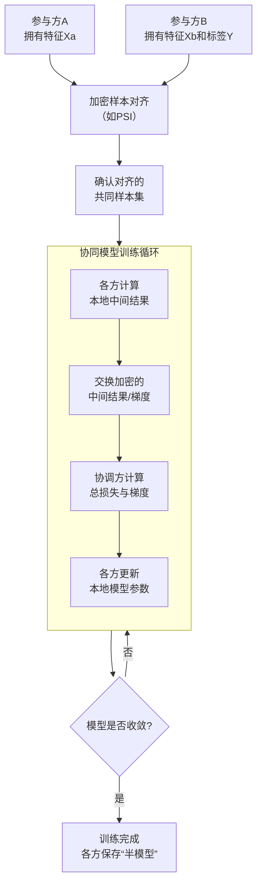

好的，我们来深入、详细地讲解纵向联邦学习的训练流程。这个流程非常精妙，体现了如何在保护隐私的前提下实现协同计算。

为了让你先有一个宏观的认识，下图清晰地展示了纵向联邦学习训练过程的核心步骤与数据流转：

---

### 🔎 流程核心步骤详解

下面，我们沿着上图的流程，对一个典型的场景（银行【参与方A】和电商【参与方B】联合训练一个信贷模型）进行分步解析。

#### 第0步：前提准备

*   **参与方**：银行（拥有用户收入、负债等金融特征，记为 `X_a`）、电商（拥有用户消费记录、浏览行为等特征，记为 `X_b`，以及我们想要预测的**标签**，比如“是否逾期”，记为 `y`）。
*   **目标**：联合双方特征，训练一个预测 `y` 的模型，但双方的原始数据 `X_a`, `X_b`, `y` 都不能离开本地。
*   **密码学工具**：约定使用同态加密算法。电商作为**持有标签的一方**，通常承担 **“协调方”** 的角色。

#### 第1步：加密样本对齐

*   **目标**：在不暴露各自用户列表的前提下，找出银行和电商共同拥有的用户。
*   **过程**：
    1.  银行和电商各自拿出自己的用户ID列表（如手机号、身份证号的哈希值）。
    2.  双方运行一个**隐私集合求交（PSI）** 协议。协议结束后，双方都只知道自己和对方重合的用户有哪些，但不知道对方独有的用户是谁。
    3.  此后，所有的训练都只基于这批**对齐的共同用户**进行。

#### 第2步：模型初始化与架构设计

*   **模型架构**：这是一个“分拆”的模型。
    *   银行初始化自己的 **“局部模型”** （例如一个小的神经网络），负责处理特征 `X_a`。
    *   电商初始化自己的 **“局部模型”** ，负责处理特征 `X_b`。
    *   电商（协调方）还初始化一个 **“顶层模型”** （通常是一个简单的分类器，如逻辑回归），用于接收并聚合双方局部模型的输出。

#### 第3步：协同训练循环（核心）

这是最关键的步骤，我们以一次迭代为例，对应图中“协同模型训练循环”子图：

1.  **前向传播**：
    *   **银行端**：输入对齐用户的特征 `X_a`，通过银行的局部模型 `Model_A`，得到输出（中间结果）`Z_a`。银行使用同态加密公钥对 `Z_a` 进行加密，得到 `[[Z_a]]`，然后发送给电商。
    *   **电商端**：输入对齐用户的特征 `X_b`，通过电商的局部模型 `Model_B`，得到输出 `Z_b`。由于电商是协调方，它已经拥有 `Z_b` 和标签 `y`，并收到了加密的 `[[Z_a]]`。
    *   **聚合计算**：电商在加密状态下计算 `[[Z]] = [[Z_a]] + Z_b`（注意：`Z_b` 是明文的，但加到密文上结果仍是密文）。然后将 `[[Z]]` 输入到顶层模型，计算出加密状态的预测结果 `[[y_hat]]` 和加密状态的损失 `[[Loss]]`。

2.  **反向传播**：
    *   **梯度计算**：电商根据加密的损失 `[[Loss]]`，计算出加密状态的梯度 `[[∂L/∂Z]]`。然后将 `[[∂L/∂Z]]` 直接（或拆分为 `[[∂L/∂Z_a]]`）发送回银行。
    *   **梯度解密与回传**：
        *   **银行**：收到 `[[∂L/∂Z_a]]` 后，用自己的私钥解密，得到明文梯度 `∂L/∂Z_a`。然后用这个梯度反向传播，更新自己的局部模型 `Model_A` 的参数。
        *   **电商**：它自己拥有 `∂L/∂Z`，可以计算出 `∂L/∂Z_b`，并用它来更新自己的局部模型 `Model_B` 的参数。同时，它也用这个梯度来更新顶层模型的参数。

#### 第4步：迭代与输出

*   重复**第3步**，直到模型损失收敛或达到预定的迭代次数。
*   **训练完成**：训练结束后，银行保有它自己的局部模型 `Model_A`，电商保有它自己的局部模型 `Model_B` 和顶层模型。
*   **预测**：未来要对一个新用户进行预测时，必须银行和电商协作才能完成：银行提供 `Z_a`，电商提供 `Z_b`，然后在电商端（或安全环境下）聚合 `Z = Z_a + Z_b`，并通过顶层模型得到最终预测结果 `y_hat`。

---

### 💎 核心要点总结

纵向联邦学习的训练流程设计得非常精巧，其核心思想可以总结为：

1.  **数据不动，模型动，加密交互**：原始数据和标签始终保留在本地，流动的是加密的中间结果和梯度。
2.  **拆分模型**：将完整的模型按参与方拆分成多个“局部模型”和一个“顶层模型”，各方只掌握与自己特征相关的模型部分。
3.  **协同计算**：通过同态加密等密码学工具，在密文状态下完成损失和梯度的计算，从而实现在不泄露隐私的前提下共同优化模型。
4.  **“半模型”**：任何一方都无法独立完成预测，这既保护了模型本身的价值，也构成了一个相互制衡的协作关系。

希望这个详细的流程讲解能帮助你彻底理解纵向联邦学习是如何工作的。如果你对其中某个具体的技术环节（如PSI、同态加密）感兴趣，我们可以继续深入探讨。