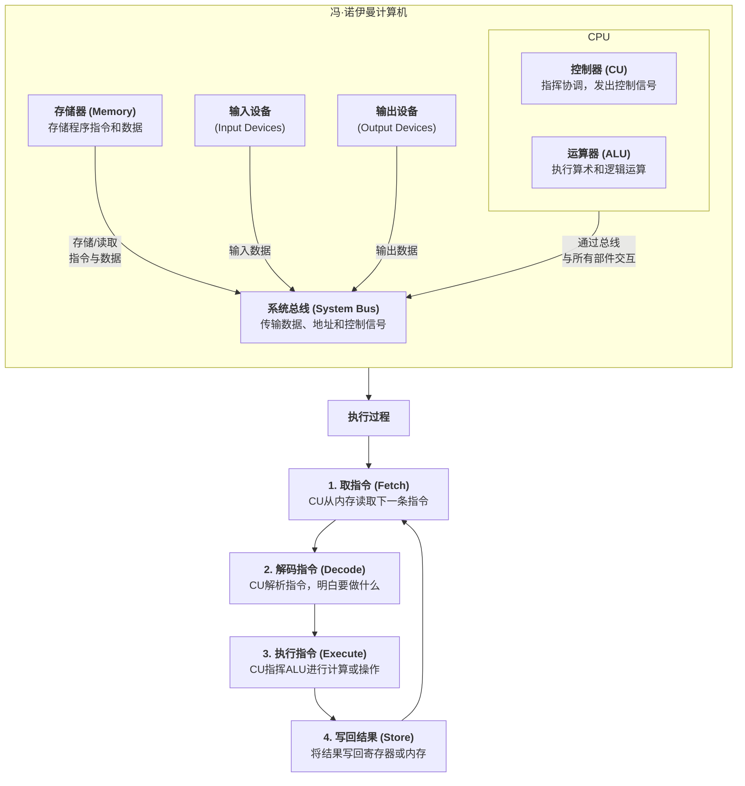

好的，我们来详细讲解**冯·诺伊曼结构**（Von Neumann Architecture）。这是现代计算机设计的基石，也被称为“**存储程序计算机**”（Stored-Program Computer）。

### 一、核心思想：两大革命性概念

在冯·诺伊曼之前，计算机（如ENIAC）是为特定任务而设计的，通过重新布线或配置开关来改变其功能，这非常繁琐。

冯·诺伊曼在1945年提出的EDVAC报告草案中，明确了两个核心思想：

1.  **存储程序 (Stored-Program)**：
    *   **程序和数据以同样的方式存储在同一个存储器中**。这意味着计算机的指令（即程序）本身可以被当作数据来处理（例如，可以被修改、被其他程序生成）。
    *   这解决了ENIAC需要手动重新布线的问题，只需将新程序加载到内存中，计算机就能执行新的任务，使得计算机成为**通用**的计算设备。

2.  **五大组成部分**：
    *   计算机应由五个基本部件组成，这些部件通过一组共享的“总线”进行通信。这五个部件是：
        1.  **运算器 (Arithmetic Logic Unit, ALU)**
        2.  **控制器 (Control Unit, CU)** （ALU和CU合称为**中央处理器，CPU**）
        3.  **存储器 (Memory)**
        4.  **输入设备 (Input Devices)**
        5.  **输出设备 (Output Devices)**

---

### 二、五大组成部分详解

下图清晰地展示了冯诺伊曼结构的五大部件及其协作关系，其中**数据流**和**控制信号/指令流**的路径是理解其工作的关键：

#### 1. 运算器 (Arithmetic Logic Unit, ALU)
*   **功能**：负责执行所有的**算术运算**（加、减、乘、除等）和**逻辑运算**（与、或、非、比较等）。
*   **地位**：是计算机的“计算核心”。

#### 2. 控制器 (Control Unit, CU)
*   **功能**：它是整个计算机的“**指挥中心**”。其工作流程即经典的 **“取指-解码-执行”周期（Fetch-Decode-Execute Cycle）**，如上图右侧所示。
*   **过程**：控制器从内存中按顺序**取出**指令，**解码**该指令确定需要完成什么操作，然后**执行**它（例如，命令ALU进行加法，或从内存读取数据）。

**ALU和控制器合在一起，就是我们现在常说的中央处理器（CPU）。**

#### 3. 存储器 (Memory)
*   **功能**：存储**程序**（指令序列）和**数据**（包括原始数据、中间结果和最终结果）。
*   **关键特性**：**可寻址**。内存被划分为许多个存储单元，每个单元都有一个唯一的地址（Address），就像大楼里的每个房间都有门牌号一样。CPU通过地址来读取或写入特定位置的数据。
*   **层次结构**：通常分为速度快、容量小、成本高的**主存储器（内存/RAM）** 和速度慢、容量大、成本低的**辅助存储器（硬盘、SSD等）**。狭义上，冯诺伊曼结构中的存储器主要指主存储器。

#### 4. 输入设备 (Input Devices) & 5. 输出设备 (Output Devices)
*   **功能**：实现**人机交互**或**与外部环境交互**。
*   **输入设备**：用于将外部的信息（数据或程序）转换为计算机能理解的二进制形式并送入存储器。例如：键盘、鼠标、扫描仪、麦克风。
*   **输出设备**：用于将计算机处理后的二进制结果转换为人或其他设备所能识别的形式并输出。例如：显示器、打印机、音响。

---

### 三、冯·诺伊曼瓶颈 (Von Neumann Bottleneck)

这是该结构的一个主要局限性。
*   **问题描述**：由于**程序指令和数据共享同一总线**，CPU在每一步操作中都需要与内存进行通信（取指令、取数据、存结果）。CPU的速度远远快于内存的读写速度，因此CPU大部分时间都在“等待”数据从内存中传输过来。
*   **比喻**：CPU是一个思考飞速的科学家，但内存是一个反应很慢的图书管理员。科学家每做一个步骤，都要停下来向管理员要下一本书（指令）和参考资料（数据），大部分时间都花在等待上。
*   **解决方案**：
    *   **引入高速缓存 (Cache)**：在CPU和内存之间设置一个速度快但容量小的缓存，存放最常用的指令和数据。
    *   **哈佛结构变体**：将程序和数据分别存储在两个独立的存储器中，并使用两条独立的总线。这在很多现代处理器（尤其是DSP和微控制器）内部得到应用。

### 总结

冯·诺伊曼结构的意义是**划时代**的。它奠定了至今为止几乎所有现代计算机的设计基础。其“存储程序”的概念使计算机获得了无与伦比的**通用性和灵活性**，成为了真正的“通用计算机”。

尽管存在“冯·诺伊曼瓶颈”，但通过缓存等技术的优化，它依然是计算机设计中最核心、最经典的理论模型。