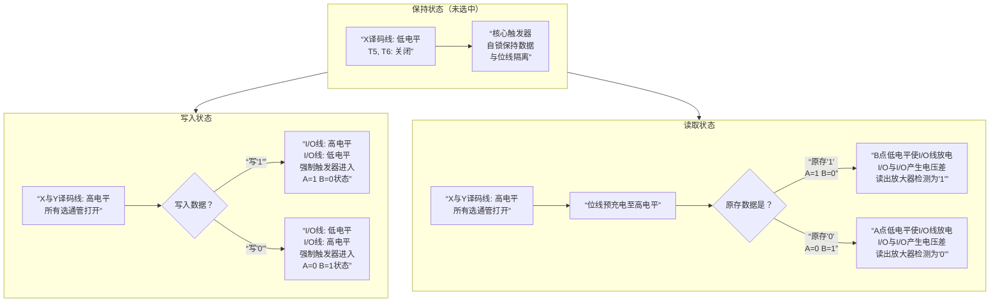

好的，这部分课件内容非常硬核，它深入到了 **SRAM（静态随机存储器）** 是如何在物理层面实现**一个二进制位（0或1）的存储和读写**的。这正是计算机最底层的奥秘。

我来为你详细图解这个 **“六管SRAM基本存储元”** 的工作原理。

---

### 一、SRAM的基本存储元

**核心概念**：一个 **“基本存储元”** 就是一个能“记住”一个0或1的最基本电路单元。对于SRAM来说，这个单元的核心是一个**触发器**。

**电路构成**：如课件所示，它由**6个MOSFET晶体管**组成，所以叫“六管SRAM”。
*   **T1, T2, T3, T4** 构成了一个**交叉耦合的反相器环路**。这是存储数据的核心。
    *   T1和T2是一对，T3和T4是一对。
    *   A点和B点的电平**总是相反**的。
*   **T5, T6** 是**行选通管**，受 **X地址译码线** 控制。相当于这个存储单元的大门。
*   **T7, T8** 是**列选通管**，受 **Y地址译码线** 控制，并连接到位线 **I/O** 和 **I/O** 上。它们控制着数据进出的通道。

为了更直观地理解，我们可以将这个过程分为三个状态来看待。下图清晰地展示了SRAM在**保持、写入和读取**三种状态下的工作原理：

### 状态详解

上图展示了三种核心状态，其工作原理如下：

#### 1. 保持状态
这是SRAM“记忆”数据的关键。
*   **条件**：X地址译码线为低电平，T5、T6关闭。
*   **过程**：核心的**交叉耦合反相器（T1-T4）** 形成一个**正反馈环路**。它会自我强化并锁定当前的状态：
    *   如果初始状态是 **A=高(1), B=低(0)**：A的高电平使T2导通，将B点拉低为0；B的低电平使T1截止，维持A的高电平。如此循环，状态得以稳定保持。
    *   如果初始状态是 **A=低(0), B=高(1)**，原理相同，方向相反。
*   **特点**：只要持续供电，这个状态就能**一直保持下去**，所以是“静态”RAM。这与需要不断“刷新”的DRAM完全不同。

#### 2. 写入状态
当我们需要改变这个存储元的数据时。
*   **条件**：CPU通过地址线找到这个单元，X和Y地址译码线均变为高电平，**打开所有选通管（T5, T6, T7, T8）**，打通了核心触发器与外部数据通道（位线）的连接。
*   **写“1”**：
    *   外部电路将 **I/O 线置为高电平**，**I/O 线置为低电平**。
    *   强大的位线信号会**强行推翻**触发器原来的状态：I/O的高电平通过T5、T6传到A点，使A点变为高电平；同时I/O的低电平传到B点，使B点变为低电平。触发器被强制置为 **A=1, B=0** 的状态。
*   **写“0”**：过程相反。
*   **完成后**：撤消译码线信号，电路回到**保持状态**，将新的数据锁存起来。

#### 3. 读取状态
当CPU需要知道这个存储元里存的是什么数据时。
*   **条件**：与写入类似，X和Y地址译码线变为高电平，**打开所有选通管**。
*   **过程**：
    1.  在进行读取操作前，**I/O 和 I/O 两条位线都会被预充电到一个相同的高电平**。
    2.  选通管打开后：
        *   如果原存数据是 **“1” (A=1, B=0)**：
            *   A点的高电平对I/O线影响不大。
            *   **B点的低电平会通过T6，使I/O线开始放电，电压下降**。
        *   如果原存数据是 **“0” (A=0, B=1)**：
            *   A点的低电平会通过T5，使I/O线开始放电，电压下降。
            *   B点的高电平对I/O线影响不大。
    3.  **检测**：位于位线末端的**灵敏放大器**会检测I/O和I/O之间微小的电压差。I/O电压更低表示读出了“0”，I/O电压更低表示读出了“1”。
*   **关键**：读取过程是**非破坏性**的。它只是让位线轻微放电，并不会改变触发器核心（A和B点）的状态。完成后电路依然回到**保持状态**，数据完好无损。

---

### 总结：SRAM的特点

通过这个六管电路，我们可以理解SRAM的优缺点：
*   **优点**：速度快、状态稳定（无需刷新）。
*   **缺点**：电路复杂（一个bit要6个管子）、集成度低、功耗大、成本高。

正因为这些特点，SRAM被用作对速度要求极高的**CPU缓存**，而不用作成本敏感的主内存。希望这个详细的讲解能让你看透这张电路图背后的精妙逻辑！