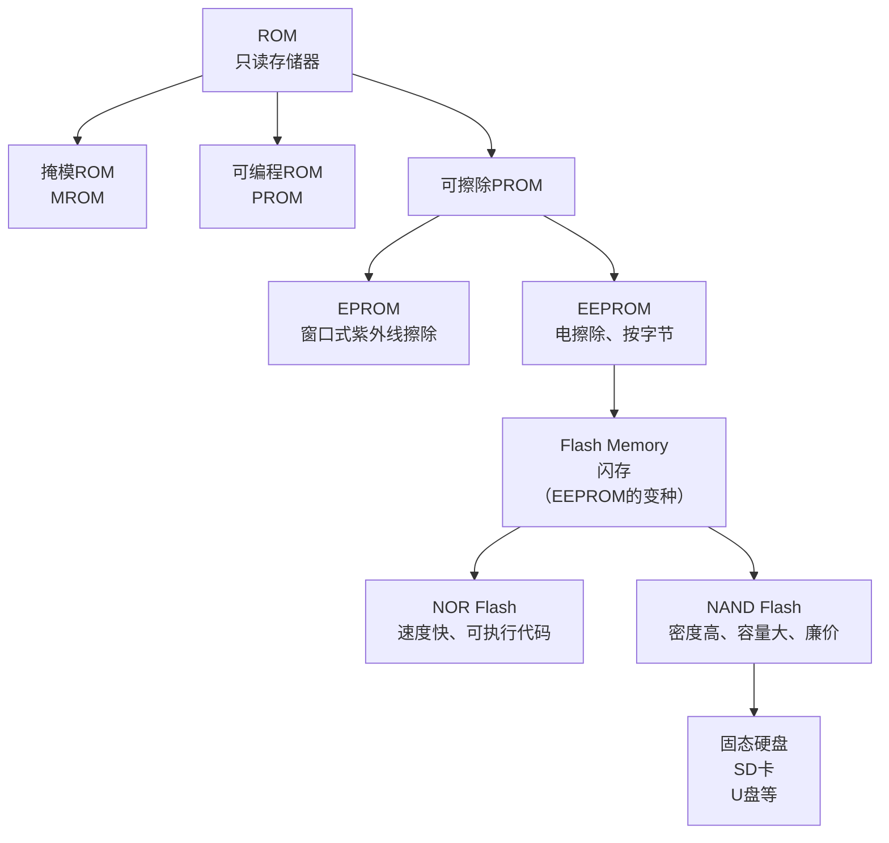

好的，我们来系统地介绍一下 **ROM（只读存储器）** 及其类别。这部分内容在你的计算机组成原理中至关重要，它解释了计算机如何存储那些“不需要改变”的关键信息。

### 什么是ROM？

*   **全称**：Read-Only Memory，只读存储器。
*   **核心特性**：
    1.  **非易失性**：断电后，存储的信息**不会丢失**。这是它与DRAM、SRAM最根本的区别。
    2.  **“只读”性**：在正常工作模式下，存储的内容只能被读出，而不能像RAM那样被CPU快速地、随机地写入。
*   **主要用途**：用于存储那些固定不变的程序和数据。最典型的例子就是计算机的 **BIOS/UEFI**（基本输入输出系统），它负责启动计算机的最初阶段。此外，还广泛应用于手机、路由器、嵌入式系统、游戏卡带等设备中，用于存储固件。

**注意**：“只读”这个概念是历史性的。现代大多数ROM实际上是可以写入的，只不过写入过程（称为“编程”或“烧录”）比RAM的写入慢得多，且通常需要特殊的条件（如高电压）。

---

### ROM的类别（按编程方式划分）

ROM技术的发展，本质上就是其“可重写”灵活性不断提升的历史。我们可以通过下面这张思维导图，一览ROM的家族全貌及其演进关系：

下面我们来详细解读图中的各个类别：

#### 1. 掩模ROM

*   **工作方式**：在芯片制造工厂里，通过最后一道“掩模”工艺将数据“刻”在电路里。一旦制造完成，数据就**永久固定，无法更改**。
*   **优点**：在大批量生产时，**成本极低**。
*   **缺点**：开发周期长，没有任何灵活性，数据有误则整批报废。
*   **类比**：就像印刷出版的书籍，内容在印刷时就已经固定。

#### 2. PROM

*   **全称**：Programmable ROM，可编程只读存储器。
*   **工作方式**：允许用户使用专门的烧录器（编程器）**写入一次**数据。通常通过烧断内部的熔丝或反熔丝来实现编程。
*   **优点**：比掩模ROM灵活，适合小批量生产或研发阶段。
*   **缺点**：**只能写入一次**，写错就无法修改。
*   **类比**：就像一张一次性的光盘（CD-R），你可以自己刻录内容，但刻完就不能改了。

#### 3. EPROM

*   **全称**：Erasable Programmable ROM，可擦除可编程只读存储器。
*   **工作方式**：
    *   **擦除**：芯片上有一个石英玻璃窗口，用**紫外线**照射这个窗口（通常15-20分钟），就可以擦除所有数据。
    *   **编程**：再次使用编程器写入新的数据。
*   **优点**：可以**多次重复使用**（通常上百次）。
*   **缺点**：擦除过程麻烦（需要离机、用紫外线灯照射），且**只能整片擦除**，不能只擦除部分数据。
*   **类比**：就像一块白板，你可以写满内容，但要修改时必须用板擦把整个板子全部擦干净，然后再重新写。

#### 4. EEPROM

*   **全称**：Electrically Erasable Programmable ROM，也可擦除可编程只读存储器。
*   **工作方式**：这是EPROM的巨大进步。它可以直接在电路板上，通过**施加特定的电信号**来擦除和编程，无需紫外线。
*   **优点**：
    *   擦写方便，无需从电路板上取下。
    *   最大的进步是：可以**按字节进行擦除和重写**，而无需擦除整个芯片。
*   **缺点**：相对于后来的Flash，成本较高，集成度较低。
*   **类比**：就像一个活页笔记本，你可以直接找到某一页，对其进行修改或替换，而不影响其他页。

#### 5. Flash Memory - 当今绝对的主流

*   **中文名**：**闪存**。可以看作是EEPROM的一种高性能、高集成度的变种。
*   **工作方式**：同样使用电信号进行擦除和编程。
*   **与EEPROM的关键区别**：Flash存储器**不能按字节擦除**，而是必须以 **“块”** 或 **“扇区”** 为单位进行擦除（比如一次擦除512字节或4KB），然后再按字节或更小的页进行编程。
    *   **NOR Flash**：读取速度快，支持“芯片内执行”，CPU可以直接从其读取指令执行。常用于存储BIOS、嵌入式系统启动代码。
    *   **NAND Flash**：密度更高、容量更大、成本更低、写入和擦除速度更快。但读取速度稍慢，且不支持芯片内执行，需要先复制到RAM中运行。**我们日常接触的SSD、U盘、SD卡、手机存储等，核心都是NAND Flash**。
*   **优点**：结合了高密度、低成本、非易失、抗震等优点。
*   **缺点**：有写入次数限制（寿命问题，需要“磨损均衡”算法来管理）。

---

### 总结对比

| 类型 | 可编程次数 | 擦除方式 | 特点 | 典型应用 |
| :--- | :--- | :--- | :--- | :--- |
| **掩模ROM** | 1次（工厂制作） | 不可擦除 | 成本最低，大批量 | 固定程序的消费电子产品 |
| **PROM** | 1次（用户） | 不可擦除 | 灵活性优于掩模ROM | 小批量原型机 |
| **EPROM** | 约100次 | 紫外线整片擦除 | 可重复使用，但擦除麻烦 | 旧式BIOS、开发调试 |
| **EEPROM** | 10万次以上 | 电信号按字节擦除 | 使用最方便，可局部修改 | 存储设备配置参数、小量数据 |
| **Flash** | NAND: 千至万次 | 电信号按块擦除 | 高密度、大容量、低成本 | **SSD, U盘, 手机存储, SD卡** |

希望这个详细的讲解能帮助你完全理解ROM的家族谱系！