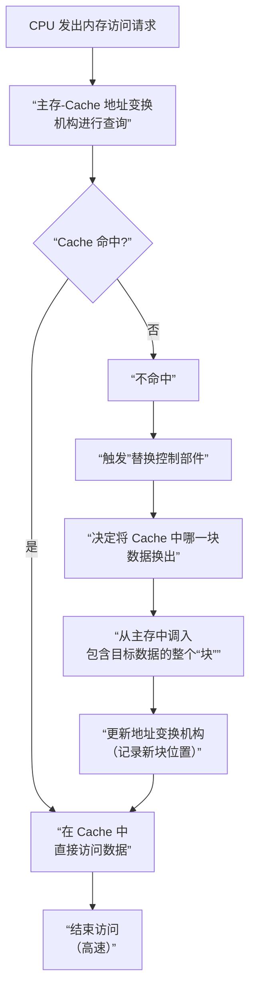

好的，这两页课件结合起来，非常精炼地勾勒出了 **Cache 存储器**的核心构成和工作原理。我们来详细拆解一下。

---

### 一、Cache 的构成基础：“块”的概念

课件第一页首先引入了一个至关重要的概念——**“块”**。

*   **什么是“块”？**
    “块”是 Cache 和主存之间**数据交换的基本单位**。你可以把它想象成图书馆搬书时用的“书箱”，一次不是拿一本，而是拿一箱。

*   **具体规则：**
    1.  **划分**：Cache 和主存都被划分为大小相等的多个块。
    2.  **数目不同**：主存的块数远远多于 Cache 的块数（因为主存容量比 Cache 大得多）。
    3.  **块的大小**：通常是几十个字节。其设计目标是**让主存在一个读/写周期内就能把整个块传送出来**，这优化了数据传输效率。

**为什么要有“块”？**
这基于 **==程序访问的局部性原理==**：
*   **空间局部性**：如果某个存储单元被访问，那么它**邻近的单元**也很可能很快被访问。
*   因此，当 CPU 需要某个数据时，我们不仅把该数据本身，还把它周围的一整块数据（比如连续的 64 字节）都从慢速的主存**一次性**取到快速的 Cache 中。这样，CPU 接下来访问这块内的其他数据时，就能直接在 Cache 中找到，从而显著提升效率。

---

### 二、Cache 的工作原理

第二页课件的图示清晰地展示了当 CPU 要访问内存时，整个系统是如何协同工作的。这个过程可以分解为以下几个核心步骤和部件：

#### 核心部件解读

1.  **CPU**：发出访问请求的源头。
2.  **主存地址寄存器**：暂存 CPU 发出来的、要访问的**完整主存地址**。
3.  **==主存—Cache 地址变换机构==**：这是 Cache 系统的 **“大脑”** 或 **“查询员”**。它的任务是**判断** CPU 要访问的数据是否已经在 Cache 中。
4.  **Cache 存储器**：高速存储体本身，存放着主存中部分数据的副本。
5.  **Cache 地址寄存器**：如果数据在 Cache 中，这个部件负责存放该数据在 Cache 中的**具体位置（地址）**。
6.  **替换控制部件**：当数据不在 Cache 中，且 Cache 已满时，这个部件负责决定 **“踢掉”** Cache 中的哪一块旧数据，为新数据腾出空间。
7.  **主存**：数据的最终仓库。

#### 工作流程（命中 vs. 不命中）

整个流程围绕着一次“查询”的结果展开，即 **“命中”** 或 **“不命中”**。

**结果：**
*   **命中**：CPU 直接从 Cache 获取数据，整个过程非常快，是理想情况。
*   **不命中**：CPU 需要等待数据从慢速的主存调入，速度很慢。系统设计的目标就是通过各种预测和映射算法，尽可能提高**命中率**。

---

### 总结与类比

你可以把 Cache 系统想象成一个**高效的图书馆工作台**：

*   **主存** = 巨大的中央书库。
*   **Cache** = 图书馆员手边的小推车（工作台），容量有限。
*   **“块”** = 书架上按主题排列的、放满书的**书盒**。一次拿一盒。
*   **地址变换机构** = 图书馆员的**记忆力**，他知道小推车上现在有哪些书盒。
*   **CPU** = 向馆员索要书籍的读者。

**工作流程：**
1.  读者要一本书。
2.  馆员先看小推车（Cache）上有没有（**查询**）。
3.  **如果有（命中）**，馆员立刻从手边的小推车上把书递给读者（**高速**）。
4.  **如果没有（不命中）**，馆员就去中央书库（主存），把包含这本书的**整个书盒（块）** 都搬过来。如果小推车满了，他还要先决定把哪个旧书盒放回书库（**替换**）。然后把新书盒放到小推车上，并记住里面有什么（**更新映射**），最后才把书递给读者（**低速**）。

这个精妙的机制，正是现代计算机能够高效运行的关键之一。