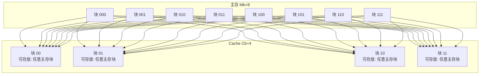

好的，我们专门来深入讲解 **全相联映射**，这是三种映射方式中理论上最灵活、冲突概率最低的一种。

---

### 一、核心思想：极致的灵活性

**全相联映射的核心规则非常简单粗暴：**

> **主存中的任何一块，可以被放置到 Cache 中的任何一块空闲位置。**

*   **“全”** 指的是主存块可以对应 **全部** 的 Cache 块。
*   **“相联”** 指的是在查找时，需要将主存地址与 Cache 中 **所有块** 的标签进行关联比较。

这就像一个完全自由的停车场：
*   **主存块** 是一辆辆汽车。
*   **Cache** 是一个小型停车场。
*   **规则**：任何一辆车，只要停车场有空位，就可以停进去，**不固定车位**。

---

### 二、工作原理详解

我们结合你课件中的例子来说明：
*   Cache 块数 Cb = 4（00, 01, 10, 11）
*   主存块数 Mb = 8（000, 001, 010, 011, 100, 101, 110, 111）

#### 1. 地址映射（建立规则）

映射关系如下图所示，它展示了这种“任意放置”的可能性：

**结论**：从图中可以直观看出，主存的每一个块都有一条线连接到Cache的每一个块，这意味着它们可以存放在任意位置。当前Cache中存放了000、001、010、011四个主存块，这只是一种可能的缓存状态。

#### 2. 地址变换（查找过程）

当CPU给出一个主存地址时，如何知道数据在不在Cache里？如果在，又在哪个块里？

这就需要进行 **地址变换**。全相联映射的地址变换过程如下：

**第一步：拆分地址**
在全相联映射中，主存地址被划分为两个部分：
*   **块内地址**：指定数据在块内的具体位置（因为块大小>1字节）。
*   **主存块号**：这是地址的剩余部分，用于唯一标识这个主存块。

**第二步：关键查找**
系统需要拿着这个 **主存块号**，去和Cache中 **所有块** 的 **标签** 进行比较。
*   **==标签==**：==每个Cache块都有一个“标签”，记录了自己当前存放的是哪个“主存块号”==。
*   **比较器**：需要大量的硬件比较器，**同时** 将主存块号与所有Cache块的标签进行比较。

**第三步：得出结果**
*   **命中**：如果发现某个Cache块的标签与要访问的**主存块号**匹配，则命中。此时，**Cache地址** 就是该匹配块在Cache中的位置（块号），结合**块内地址**即可找到数据。
*   **不命中**：如果所有Cache块的标签都不匹配，则不命中。需要从主存调入该块，并找一个空闲Cache块（或通过替换算法踢掉一个旧块）放入，同时更新该Cache块的**标签**为新的主存块号。

---

### 三、全相联映射的优缺点

#### 优点：
1.  **冲突概率最低，空间利用率最高**。
    *   只要Cache有空位，新的主存块就可以装入，不会因为“位置已被占用”而发生冲突。这能带来非常高的**命中率**。

#### 缺点：
1.  **实现成本高，速度慢**。
    *   这是它最致命的缺点。因为查找时需要 **==同时比较所有Cache块的标签==**，这需要一个巨大的、昂贵的 **==相联比较器电路==**。当Cache容量增大时，比较器的规模和复杂度会急剧上升，导致电路延迟增加，难以做成高速。
2.  **替换算法复杂**。
    *   由于主存块可以放在任何位置，当Cache满时，选择替换哪一块就变得非常复杂（比如需要采用LRU等复杂算法），这也会增加硬件开销。

---

### 总结

**全相联映射是一种理想但昂贵的映射方式。**
它提供了最大的灵活性，理论上能实现最高的命中率。但由于其硬件实现上的高成本和复杂性，它**不适合大容量的、对速度要求极高的Cache**。

在实践中，它通常用于一些对容量要求不高、但希望最大限度避免冲突的场合，例如 **TLB** 就经常采用全相联或组相联映射。而CPU内部的一级、二级Cache则普遍采用折中的**组相联映射**，以在成本和性能之间取得平衡。