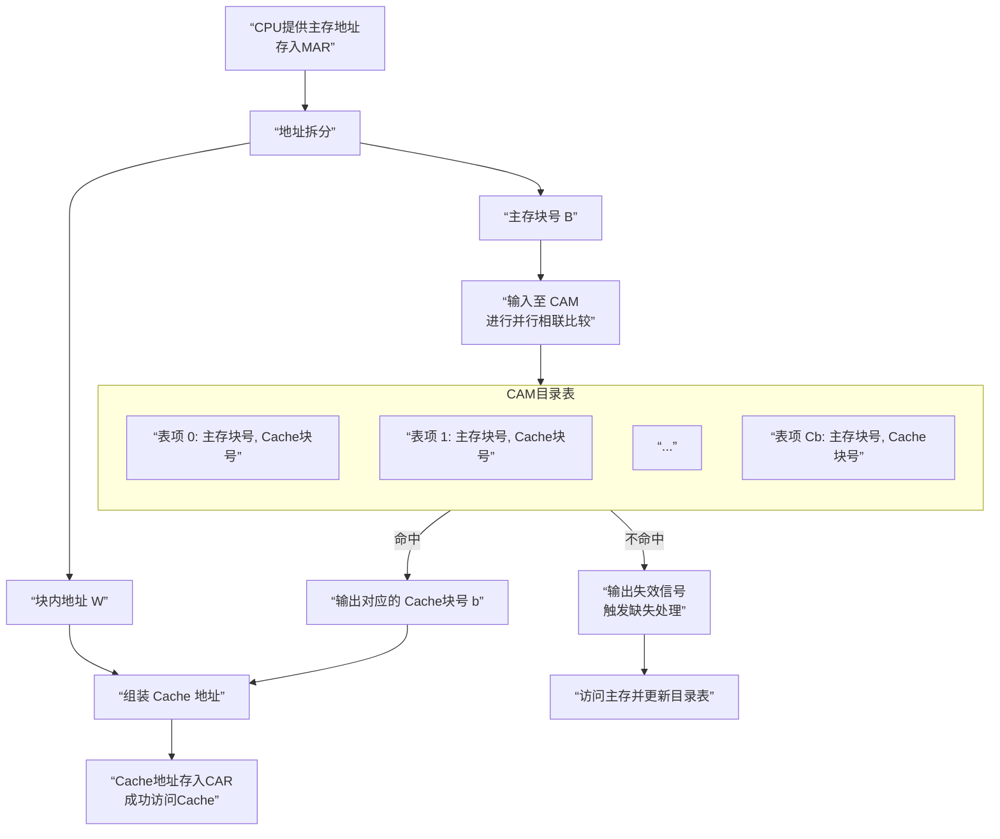

好的，你提供的这两页课件非常关键，一页总结了**特点**，另一页揭示了实现全相联映射的**核心硬件机制——CAM**。我们将结合之前的概念，进行一次更深入、更系统的讲解。

---

### 一、全相联映射的核心思想回顾

**规则**：主存中的**任意**一个块，可以映射到 Cache 中的**任意**一个块位置。
**类比**：一个完全自由停车的小型停车场，任何车（主存块）可以停在任何空车位（Cache块）。

---

### 二、实现的关键：目录表与CAM

全相联映射之所以能工作，全靠一个叫做 **“目录表”** 的特殊部件。你的第二页课件详细描绘了这一点。

#### 1. 目录表是什么？

*   **定义**：目录表是一个存储在特殊内存中的表格，它实时记录了 **当前Cache中每一个块** 存放的究竟是 **哪个主存块**。
*   **大小**：表格的行数等于 Cache 的块数。
*   **表项内容**：每一行（每一个表项）包含 **==两个核心字段==**：
    *   **主存块号**：记录当前这个Cache块里存放的数据是来自主存的哪个块。
    *   **Cache块号**：这个Cache块自身的地址。

#### 2. 目录表的物理实现：==CAM==

课件中提到“用CAM构成目录表”，这是理解全相联映射成本和速度的**钥匙**。

*   **CAM**：全称为 **Content-Addressable Memory**，中文是 **==按内容寻址存储器==**。
*   **它与普通RAM的根本区别**：
    *   **普通RAM**：你给出一个**地址**，它返回存储在那个地址上的**数据**。
    *   **CAM**：你给出一个**数据**，它会在整个存储器中**并行地搜索**，并告诉你这个数据**存储在哪个地址**（如果存在的话）。

**这正是全相联地址变换所需要的！**
让我们把CAM的工作方式代入到目录表中：
*   **目录表** 就是一块CAM。
*   其中存储的 **“主存块号”** 就是CAM里存储的**数据**。
*   对应的 **“Cache块号”** 就是CAM返回的**地址**。

---

### 三、地址变换过程的深度解析

现在，我们结合CAM目录表，来重现第二页课件图中的那个地址变换过程。当CPU发出一个内存地址（存放在MAR中）时：

**第一步：拆分地址**
*   ==将MAR中的主存地址拆分成两部分：**主存块号** 和 **块内地址**==。

**第二步：并行相联比较（核心步骤）**
*   CPU将 **主存块号** 作为“搜索关键字”，输入到 **CAM（目录表）** 中。
*   **CAM内部硬件会同时、并行地将这个“主存块号”与目录表中所有的“主存块号”字段进行比较。**
    *   **命中**：如果找到匹配项，CAM会输出一个**有效信号**以及匹配项对应的 **Cache块号**。
    *   **不命中**：如果没有找到匹配项，CAM输出**失效**信号。

**第三步：组装Cache地址**
*   **如果命中**：将CAM输出的 **Cache块号** 和 MAR中原有的 **块内地址** 组装在一起，就形成了最终的Cache地址，送入 **==CAR（Cache地址寄存器）==**。CPU就可以用这个地址快速访问Cache获取数据了。
*   **如果不命中**：触发“缺失处理”，需要从主存中调入该数据块，并更新目录表（CAM）。

整个过程如下图所示，它清晰地展示了数据（主存块号）如何通过CAM被转换为地址（Cache块号）：

### 四、再谈特点：为什么又贵又慢？

现在，我们可以从硬件层面深刻理解第一页课件总结的两个特点了：

1.  **块的冲突率最小，Cache利用率高**
    *   **原因**：因为数据可以放在任何位置，只要Cache有空位，就不会冲突。这最大限度地利用了Cache的存储空间。

2.  **代价较高（CAM），相联比较的时间较长，影响Cache的速度**
    *   **代价高**：CAM芯片的每个存储单元都比普通RAM单元复杂得多（需要包含比较电路），因此**制造成本高、功耗大、占用芯片面积大**。
    *   **==速度慢==**：尽管CAM是并行比较，但当容量增大时，这么多比较电路同时工作产生的**信号传输延迟和功耗**会变得显著，这个并行比较的时间仍然会超过直接映射那种简单的“索引”方式。因此，**==全相联映射的访问周期通常比其他映射方式要长==**。

### 总结

全相联映射通过 **CAM目录表** 这一硬件设施，实现了极其灵活的数据放置策略。它的高性能（高命中率）是以其高成本和高延迟为代价的。这是一种 **“用硬件复杂度换取软件性能”** 的经典设计权衡。

正因为如此，在追求极速的CPU一级Cache中，它很少被直接使用，而是采用了一种折中的 **组相联映射**，后者在获得大部分全相联优点的同时，有效地控制了硬件的复杂度。