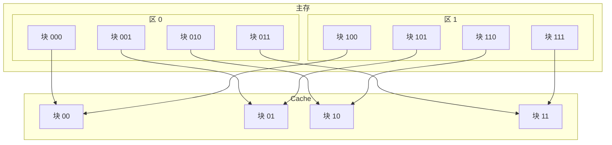
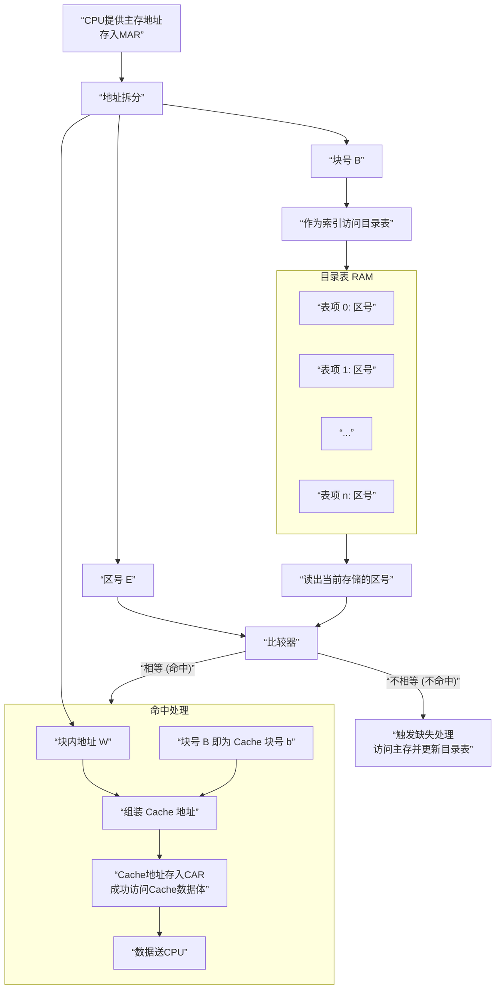

好的，我们终于来到了三种映射方式中最简单、最直接的一种——**直接映射**。它和全相联映射是两个极端。

---

### 一、核心思想：严格对号入座

**直接映射的核心规则非常固定：**

> **主存中的每一个块，在 Cache 中都有且只有一个唯一指定的位置可以存放。**

这个规则是通过引入 **“区”** 的概念来实现的，具体分为两步：

1.  **分区**：将整个主存空间划分成若干个大小与 Cache 完全相同的 **“区”**。
2.  **对号入座**：规定所有区中 **序号相同** 的块，只能映射到 Cache 中 **那个相同序号** 的块位置上。

**一个经典的类比：宿舍分配**
*   **主存**：一栋巨大的宿舍楼。
*   **区**：这栋楼里的每一个 **单元**（例如，每层楼就是一个区）。
*   **块**：每个单元里的 **房间号**（例如，101, 102...）。
*   **Cache**：宿舍管理员手边的一个 **微型楼模型**，它只包含一个单元的所有房间。
*   **规则**：无论你来自哪个单元（哪层楼），只要你住的是101房间，那么你在管理员的模型上，就只能放在标着“101”的那个格子里。

---

### 二、工作原理详解

我们结合你课件中的例子来说明，这个例子非常清晰：
*   **Cache 块数 Cb = 4**（块号: 00, 01, 10, 11）
*   **主存块数 Mb = 8**
*   因为主存大小是 Cache 的 2 倍，所以主存被划分为 **2 个区**（区号: 0, 1）。每个区有 4 个块，与 Cache 块数一致。

其映射关系如下图所示，体现了严格的“对号入座”规则：

**结论**：从图中可以清晰看到，主存中所有块号（最后两位）为 `00` 的块（000和100），都只能映射到Cache的 `00` 块。其他块号同理。这就是严格的“对号入座”。

#### 地址格式
为了适应这个规则，主存地址被重新划分：
*   **MAR**：**区号 E** + **块号 B** + **块内地址 W**
*   **CAR**：**块号 b** + **块内地址 w**
    *   其中，**块号 B 和 b 是相同的**（正是映射规则的核心）。
    *   块内地址 W 和 w 也是相同的。

---

### 三、地址变换过程的深度解析

直接映射的地址变换过程是其最大的优点——**极其简单、快速**。我们结合第二页课件图来看：

**第一步：拆分地址**
*   将MAR中的主存地址拆分成三部分：**区号 E**、**块号 B**、**块内地址 W**。

**第二步：索引与比较（核心步骤）**
1.  **索引**：直接用 **块号 B** 作为地址，去访问Cache的 **目录表**（这个目录表现在可以用普通的RAM实现，而不需要昂贵的CAM）。目录表的每一行存储着该Cache块当前存放的数据所属的 **区号 E**。
2.  **比较**：将从目录表中读出的 **区号 E** 与MAR中的 **区号 E** 送入一个 **比较器**。
    *   **相等**：说明命中！当前Cache块中的数据正是我们想要访问的主存块。
    *   **不相等**：说明冲突缺失！虽然Cache的这个位置有数据，但它是另一个区的同名块的数据，不是我们想要的。

**第三步：组装地址与输出**
*   **如果命中**：**块号 B** 直接作为Cache地址的块号 **b**，与 **块内地址 w** 组装成CAR，访问Cache数据体。同时，从数据体中读出的数据通过一个多路选择器送CPU。
*   **如果不命中**：触发“缺失处理”，访问主存，将新的数据块调入Cache的 **B号位置**，并同时更新目录表中该位置的 **区号 E** 为新的区号。

整个过程可以可视化如下，可以看到其电路非常简单直接：

### 四、直接映射的优缺点

现在，我们可以深刻理解第三页课件总结的特点了：

1.  **硬件实现简单，访问速度较快**
    *   **原因**：地址变换过程不需要复杂的相联搜索，只需要一次**基于块号B的索引**和一次**区号的比较**。硬件上只需要一个普通的RAM、一个比较器和一些简单逻辑电路，成本低，延迟小。

2.  **Cache的空间利用率低，常有块冲突，命中率也低**
    *   **冲突的根源**：这是其规则导致的必然缺点。如果程序交替访问两个不同区但**块号相同**的数据（比如上例中交替访问主存块000和100），它们会不停地争抢Cache的同一个位置（00块），导致即使Cache其他位置空闲，也依然会发生**冲突缺失**，数据被频繁换入换出。
    *   **后果**：这大大降低了Cache的利用效率和命中率。

---

### 总结

**直接映射是一种简单、廉价、快速的映射方案。**
它通过严格的“对号入座”规则，牺牲了灵活性和命中率，换来了硬件实现的简单性和高速度。

它通常用于对成本敏感或要求极低延迟的场合。在实际CPU设计中，纯粹的直接映射已较少见，但其“索引”的思想被继承了下来，与全相联的“比较”思想相结合，形成了实践中最主流的 **组相联映射**。