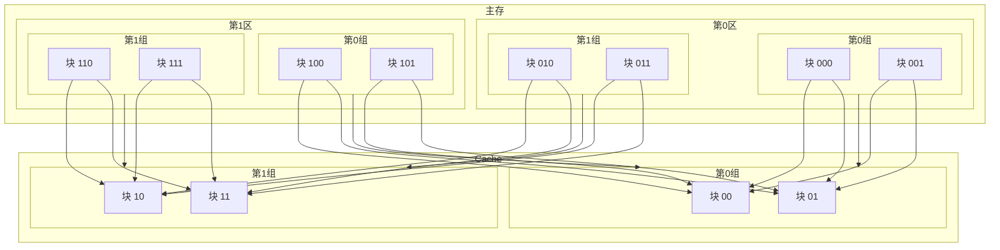
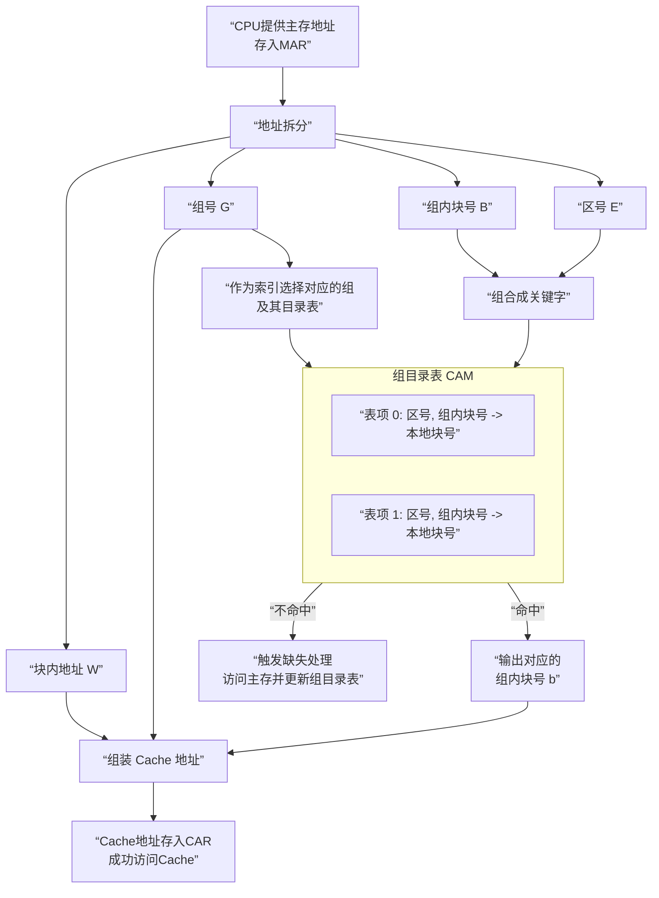

好的，现在我们来讲解第三种，也是实践中应用最广泛的映射方式——**组相联映射**。它完美地权衡了前两种方式的优缺点。

---

### 一、核心思想：博采众长的折中方案

**组相联映射的核心规则是“==组间直接映射，组内全相联映射==”。**

它吸取了两种映射方式的优点：
*   从**直接映射**中继承了 **“组”** 的概念和基于组的**索引**机制，使得硬件实现不至于太复杂。
*   从**全相联映射**中继承了组内的**灵活性**，有效降低了冲突概率。

**一个经典的类比：图书馆阅览室升级版**
*   **主存**：巨大的中央书库。
*   **Cache**：一个小型阅览室。
*   **组**：阅览室里的 **不同书架组**（比如：科技类书架组、文学类书架组）。
*   **规则**：
    1.  **组间直接映射**：严格规定“科技类的书只能放在科技类书架组”。（这是直接映射的思想，简单快速）。
    2.  **组内全相联映射**：在“科技类书架组”内部，任何一本科技书可以放在这个组里的**任何一个空闲书架上**。（这是全相联的思想，灵活，减少冲突）。

---

### 二、工作原理详解

我们结合你课件中的例子来说明，这个例子非常直观：
*   **Cache**：分为 **2 个组**（第0组，第1组）。每个组内有 **2 个块**。
*   **主存**：先分为 **2 个区**（第0区，第1区）。每个区内也分为 **2 个组**。每个组内有 **2 个块**。

其映射关系如下图所示，清晰地展示了“组间直接，组内相联”的规则：

**结论**：以主存第0区第0组（块000, 001）和第1区第0组（块100, 101）为例，它们**只能**进入Cache的第0组。但是，在Cache的第0组内部，它们两个块（比如000和100）可以存放在组内的两个块（00和01）中的任意位置，而不会像直接映射那样必然冲突。

#### ==地址格式==
为了适应这个规则，主存地址被精细划分：
*   **MAR**：**区号 E** + **组号 G** + **组内块号 B** + **块内地址 W**
*   **CAR**：**组号 g** + **组内块号 b** + **块内地址 w**
    *   其中，**==组号 G 和 g 是相同的==**（组间直接映射的体现）。

---

### 三、地址变换过程的深度解析

组相联的地址变换是前两种方式的结合，它既不需要全相联那样昂贵的全局CAM，又比直接映射更灵活。

**第一步：拆分地址**
*   将MAR中的主存地址拆分成四部分：**区号 E**、**组号 G**、**组内块号 B**、**块内地址 W**。

**第二步：索引与相联比较（核心步骤）**
1.  **索引**：直接用 **组号 G** 作为索引，找到对应的 **组目录表**。注意，**==这里有多个目录表（块表），每个组一个==**。
2.  **相联比较**：将 **区号 E** 和 **组内块号 B** 组合成查找关键字，在**该组的目录表内**进行**相联比较**（使用一个小型的CAM）。这个目录表记录了该组内每个Cache块当前存放的数据来自哪个主存的 **区号** 和 **组内块号**。
    *   **命中**：在该组内找到匹配项，同时得到该数据在组内的具体块号 **b**。
    *   **不命中**：在该组内未找到。

**第三步：组装地址与输出**
*   **如果命中**：将 **组号 G**（作为g）、得到的 **组内块号 b** 和 **块内地址 W**（作为w）组装成CAR，访问Cache。
*   **如果不命中**：触发“缺失处理”，访问主存。将新数据块调入Cache的 **第G组**，并在该组内选择一个空闲块（或根据替换算法踢掉一个块）放入，同时更新该组的目录表。

整个过程可以可视化如下，它平衡了效率与复杂性：

### 四、组相联映射的优缺点

现在，我们可以深刻理解课件总结的特点了：

**“避免了全相联方式分配页面时的大量计算，也减少了直接映射方式下块的冲突。提高了存储体系的效率，因此使用广泛。”**

1.  **优点**：
    *   **显著减少冲突**：相比直接映射，冲突概率大大降低。因为冲突现在只在**同一个组内**发生，而一个组通常只有2-8个块，不同组的块不再冲突。
    *   **硬件成本可控**：相比全相联映射，相联比较的规模从整个Cache缩小到一个组。如果一个组内有n个块，就称为 **n路组相联**。一个4路组相联Cache只需要4个比较器，而一个全相联的则需要Cb个比较器。这使得它在成本和速度上取得了绝佳的平衡。

2.  **缺点**：
    *   硬件上仍然比直接映射复杂。
    *   组内仍然需要替换算法，但因其规模小，实现高效的算法（如LRU）是可行的。

---

### 总结

**组相联映射是现代CPU Cache设计中事实上的标准。**
它通过一个巧妙的“分组”思想，将一个大问题分解为多个小问题，在获得全相联映射大部分灵活性的同时，将硬件成本控制在可接受的范围内。

我们常听到的 **==“2路”、“4路”、“8路”组相联==**，指的就是每个组内包含的块数。路数越多，越接近全相联的性能；路数越少，越接近直接映射的简单。