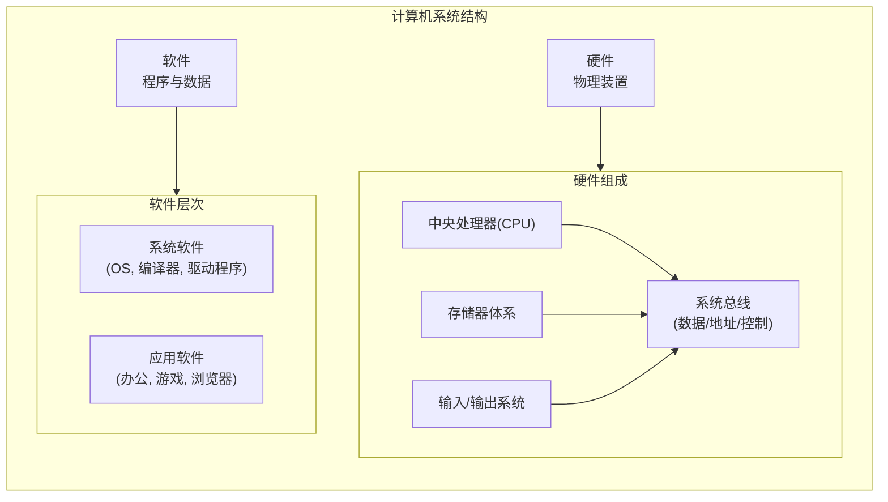
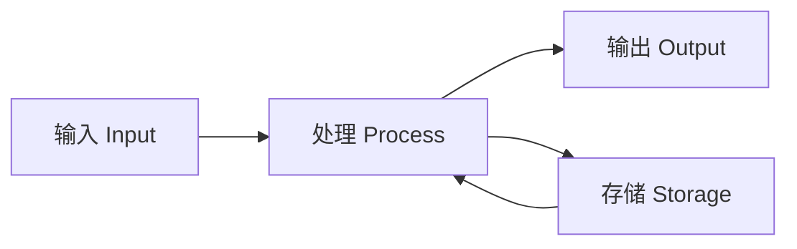
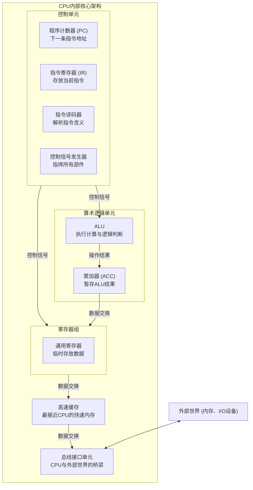

## 1.1 What is the computer architecture（计算机体系结构）?

好的，我们来全面地介绍一下**计算机体系结构**。

这是一个计算机科学的核心领域，它抽象且深刻，连接了软件的美好愿景与硬件的物理现实。

### 一、什么是计算机体系结构？

首先，我们需要明确一个关键区别：

*   **计算机体系结构**：指的是**计算机系统的概念性设计和功能特性**，是从程序员视角看到的结构和行为。它主要关心的是**硬件与软件之间的接口**。例如，指令集、寄存器定义、内存寻址方式等。
*   **计算机组成**：指的是**体系结构的具体实现**。它关心的是如何用硬件组件（如晶体管、总线、时钟）来构建一个符合特定体系结构的计算机。例如，是用流水线还是多核来实现高性能CPU。

一个经典的比喻：
*   **体系结构是蓝图**：它规定了房子要有几个卧室、几个卫生间、门窗在哪里。（**“做什么？”**）
*   **计算机组成是施工**：它决定用木头还是砖头来做墙，用哪种牌子的水管和电线。（**“怎么做？”**）

我们今天主要聚焦于**计算机体系结构**。

---

### 二、核心框架：冯·诺伊曼结构

现代计算机体系结构几乎都建立在**冯·诺伊曼结构**之上，其核心思想是“存储程序”，即程序和数据都以二进制形式存储在同一个存储器中。它定义了计算机的五个基本组成部分，这是理解所有计算机的基石：

1.  **中央处理器**：计算机的大脑，负责执行指令。
    *   **控制单元**：指挥协调其他部件工作。
    *   **算术逻辑单元**：执行所有数学和逻辑运算。
    *   **寄存器**：CPU内部的高速小型存储器，用于临时存放指令和数据。
2.  **存储器**：用于存储程序和数据（内存/RAM）。
3.  **输入设备**：将外部信息送入计算机（键盘、鼠标等）。
4.  **输出设备**：将计算结果呈现出来（显示器、打印机等）。
5.  **系统总线**：连接所有部件的通信网络，负责在各个部件之间传输数据、地址和控制信号。

---

### 三、计算机体系结构的核心层次与关键议题

要深入理解体系结构，可以从以下几个层次和关键议题入手：

#### 1. 指令集体系结构

这是软件和硬件之间最重要的**契约**。ISA定义了编译器所能生成的所有指令，以及计算机能够执行的所有操作。它是程序员（编译器等）需要理解的“机器语言”。主要分为两类：

*   **复杂指令集计算机**：
    *   **理念**：提供丰富的、功能强大的指令，一条指令可以完成复杂的操作。
    *   **特点**：指令长度可变，寻址方式多样；微代码控制；硬件复杂。
    *   **代表**：x86架构（Intel, AMD CPUs）。
*   **精简指令集计算机**：
    *   **理念**：只提供最常用、最简单的指令，复杂的操作由多条简单指令组合完成。
    *   **特点**：指令长度固定，格式简单；采用流水线技术效率高；硬件设计更简单，功耗更低。
    *   **代表**：ARM架构（绝大多数手机、平板处理器），MIPS，RISC-V。

**ISA是计算机世界的“生态系统”**，决定了哪些软件可以运行（Windows基于x86，安卓/iOS基于ARM）。

#### 2. 处理器体系结构

这是如何设计CPU以实现更高性能的核心领域。

*   **流水线技术**：像工厂的装配线，将一条指令的执行过程分解为多个阶段（取指、译码、执行、访存、写回），不同指令的不同阶段可以同时进行，极大提高了吞吐率。
*   **超标量架构**：在一个时钟周期内，CPU可以**同时发射并执行多条指令**（多个流水线并行）。这需要硬件有多个执行单元（如多个ALU）。
*   **乱序执行**：为了不让一条缓慢的指令（如等待内存数据）阻塞整个流水线，CPU会在不影响程序最终结果的前提下，动态调整指令的执行顺序，优先执行已准备好操作数的指令。
*   **分支预测**：当遇到条件跳转指令时，CPU会提前预测程序会走向哪个分支，并提前将该分支的指令放入流水线。如果预测正确，则性能提升；如果预测错误，则需要清空流水线，带来性能惩罚。
*   **多核与多线程**：
    *   **多核**：在一个物理芯片上集成多个独立的CPU核心，每个核心都有自己的执行单元，可以同时执行不同的任务（线程）。这是现代性能提升的主要途径。
    *   **同时多线程**：（如Intel的Hyper-Threading技术），通过复制一些寄存器等资源，让一个物理核心在逻辑上模拟出多个核心，从而更好地利用执行单元，提高效率。

#### 3. 内存体系结构

由于CPU速度远快于内存速度，“内存墙”是性能的主要瓶颈。体系结构师设计了层次化的存储结构来解决这个问题。

*   **存储器层次结构**：一种“缓存”思想，使用少量、快速、昂贵的内存（缓存）作为大量、慢速、廉价内存（主存）的缓冲区。
    *   **寄存器** → **L1缓存** → **L2缓存** → **L3缓存** → **主内存** → **硬盘/SSD**
    *   越往上，速度越快，容量越小，成本越高。
*   **缓存一致性**：在多核系统中，每个核心都有自己的缓存。当一个核心修改了其缓存中的数据时，必须确保其他核心的缓存副本得到更新或失效，这是通过复杂的协议（如MESI协议）来实现的。
*   **虚拟内存**：让程序认为自己拥有一大片连续的、独立的内存空间，而实际上它可能被分散地存放在物理内存甚至硬盘上。这简化了编程，提供了内存保护，并允许运行比物理内存更大的程序。

#### 4. 并行体系结构

当单个处理器的性能提升遇到物理极限时，如何将多个处理器连接起来协同工作。

*   **对称多处理**：多个相同的CPU共享同一主内存和I/O设备，运行单一操作系统。这是最常见的服务器形式。
*   **图形处理器**：最初为图形处理设计，现在已成为通用的**大规模并行计算单元**。它拥有成千上万个精简核心，非常适合处理海量数据并行的任务（如AI训练、科学计算）。
*   **分布式系统/集群**：通过网络将多台独立的计算机连接起来，共同完成一个大型任务（如谷歌的搜索引擎集群）。

---

### 四、总结：为什么计算机体系结构如此重要？

1.  **它是性能的基石**：所有的软件性能最终都依赖于底层硬件的体系结构设计。理解体系结构才能写出更高效的代码。
2.  **它驱动创新**：从个人电脑到智能手机，再到云计算和人工智能，每一次计算范式的革命都伴随着体系结构的创新（如从CPU到GPU再到TPU）。
3.  **它关乎未来**：随着摩尔定律的放缓，我们需要新的体系结构（如类脑计算、量子计算）来继续推动计算能力的边界。

总而言之，计算机体系结构是计算机的灵魂，它定义了硬件如何被软件有效地使用，是连接抽象算法与物理实体的宏伟桥梁。

---

## 1.2 What is the computer organization？

好的，这是一个关于计算机科学非常核心的概念。我会用一个清晰、结构化且易于理解的方式来介绍“计算机组织”。

---

### 什么是计算机组织？

**计算机组织** 是一门研究计算机系统内部各组成部分的**结构、工作原理以及它们之间如何相互连接和协作**以执行指令的学科。

它关注的是计算机的**物理层面**和**逻辑层面**的实现，回答的是“**如何做**”的问题。

#### 一个简单的比喻：建筑

*   **计算机架构** 就像一栋建筑的**设计蓝图**。它定义了这栋楼的功能（是住宅还是办公楼？）、外观、房间布局（有多少房间？如何连通？）、承重要求等。它关注的是**概念和功能**。
*   **计算机组织** 则是这栋建筑的**具体施工方案**。它决定使用什么材料（砖头还是钢筋？）、水管如何铺设、电线怎么走线、选择哪个品牌的电梯等。它关注的是**物理实现和性能优化**。

简单来说：
*   **架构**决定了它能**做什么**（指令集、编程模型）。
*   **组织**决定了它**如何做**以及做得有多快（微架构、硬件细节）。

---

### 为什么计算机组织很重要？

理解计算机组织可以帮助你：
1.  **编写高效的代码**：了解缓存、流水线等工作原理，可以让你写出对缓存更友好、更能被CPU高效执行的代码。
2.  **进行硬件选型**：理解不同CPU微架构（如Intel的Core系列 vs. AMD的Zen系列）的差异，能帮助你做出更明智的硬件采购决策。
3.  **理解性能瓶颈**：当程序运行缓慢时，你可以从底层分析是CPU计算慢、内存访问慢还是I/O操作慢。
4.  **奠定操作系统和编译器等课程的基础**：操作系统是硬件资源的管理者，编译器生成的代码需要被硬件高效执行，它们都建立在计算机组织的知识之上。

---

### 计算机组织的核心主题（主要组成部分）

计算机组织主要研究以下几个关键子系统，它们共同构成了经典的**冯·诺依曼体系结构**：

#### 1. 中央处理器
CPU是计算机的“大脑”，其内部又包含：
*   **控制单元**：指挥协调整个计算机系统的工作，就像乐队的指挥。
*   **算术逻辑单元**：负责执行所有的算术运算和逻辑运算，如加减乘除、与或非。
*   **寄存器组**：CPU内部极小但极快的内存，用于存放当前正在执行的指令和数据。

#### 2. 存储器层次结构
计算机使用多种不同速度、容量和成本的存储器来平衡性能和造价。
*   **寄存器**：速度最快，容量最小，在CPU内部。
*   **缓存**：分为L1、L2、L3缓存，速度极快，用于缓解CPU和主存之间的速度差距。
*   **主存储器**：我们常说的**内存**，速度较快，容量较大，断电后数据丢失。
*   **辅助存储器**：如硬盘、固态硬盘，速度慢，容量大，断电后数据不丢失。

这个层次结构体现了** locality **的原理，使得在合理的成本下，获得接近最快存储器的速度。

#### 3. 输入/输出系统
负责计算机与外部世界（用户、其他设备）进行通信。
*   **I/O设备**：如键盘、鼠标、显示器、硬盘、网卡。
*   **I/O接口**：连接CPU和I/O设备的桥梁（如USB接口、SATA接口）。
*   **数据传输方式**：如程序控制I/O、中断驱动I/O、直接内存访问。

#### 4. 总线系统
连接计算机各个组成部分的“高速公路”，用于在它们之间传输数据、地址和控制信号。
*   **数据总线**：传输数据。
*   **地址总线**：指定数据在内存中的位置。
*   **控制总线**：传输控制信号（读/写、中断等）。

#### 5. 指令的执行
这是计算机组织的核心研究内容，即CPU如何一步步处理一条指令：
1.  **取指**：从内存中读取下一条指令。
2.  **译码**：分析指令，确定需要执行什么操作。
3.  **执行**：在ALU中执行操作。
4.  **访存**：如果需要，访问内存读取或写入数据。
5.  **写回**：将结果写回寄存器。

现代CPU通过**流水线**技术让这些阶段重叠执行，就像工厂的装配线一样，极大地提高了效率。

### 总结

| 特性           | 描述                                                         |
| :------------- | :----------------------------------------------------------- |
| **定义**       | 研究计算机系统内部结构、各部件连接与协作的学科。             |
| **核心问题**   | “如何实现”计算机架构指定的功能。                             |
| **关键组件**   | CPU、存储器层次、I/O系统、总线。                             |
| **关注点**     | **性能、成本、功耗、可靠性**。                               |
| **与架构关系** | **架构是接口规范，组织是具体实现**。一种架构（如x86）可以有多种不同的组织实现（如Intel和AMD的CPU）。 |

总而言之，计算机组织揭示了抽象软件层之下的硬件世界，是理解计算机如何真正工作的基石。

---

## 1.3 What is the structure of a computer system?

好的，这是一个非常核心的计算机科学问题。我将为您深入、系统地介绍计算机系统的结构。

计算机系统的结构是一个层次化的概念，可以从不同的抽象级别来观察。最经典和基础的模型是**冯·诺依曼体系结构**，现代计算机都是基于此模型的改进和发展。

下图从宏观到微观，展示了计算机系统的核心组成结构：

---

### 一、经典模型：冯·诺依曼体系结构

1945年由数学家冯·诺依曼提出，其核心思想是“**存储程序**”，即程序和数据都以二进制的形式存储在存储器中，计算机按顺序从存储器中取出指令并执行。它由五大基本部件组成：

1.  **运算器**
    *   **功能**：负责执行所有的算术运算和逻辑运算。
    *   **组成部分**：算术逻辑单元、累加器、状态寄存器等。
    *   **类比**：计算器。

2.  **控制器**
    *   **功能**：是整个计算机的指挥中心，它从内存中读取指令，进行译码，然后向其他部件发出控制信号，协调整个系统工作。
    *   **组成部分**：指令寄存器、指令译码器、程序计数器等。
    *   **类比**：乐队的指挥。

    *在现代CPU中，运算器和控制器被集成在一起，合称为**中央处理器***。

3.  **存储器**
    *   **功能**：用于存储程序和数据。所有需要被处理的指令和数据都必须先被送入存储器。
    *   **关键特性**：按地址访问。
    *   **类比**：一个大楼里的无数个邮箱，每个邮箱有唯一地址。

4.  **输入设备**
    *   **功能**：将外部的信息（程序和数据）输入到计算机中。
    *   **例子**：键盘、鼠标、扫描仪、麦克风等。
    *   **类比**：人的眼睛、耳朵。

5.  **输出设备**
    *   **功能**：将计算机处理后的结果输出到外部世界。
    *   **例子**：显示器、打印机、音响等。
    *   **类比**：人的嘴巴、手。

**工作流程**：
1.  用户通过**输入设备**将程序和数据送入**存储器**。
2.  **控制器**从存储器中按顺序取出指令。
3.  **控制器**译码指令，并命令**运算器**执行相应的操作。
4.  处理中间结果暂存在存储器中。
5.  最终结果通过**输出设备**呈现给用户。

**冯氏结构的核心特点**：
*   **存储程序**
*   **指令顺序执行**（现代CPU已通过流水线等技术优化）
*   **五大部件**
*   **二进制表示**

---

### 二、现代计算机的实际组织结构

在实际的计算机硬件实现中，结构更为精细。其核心连接是通过**系统总线**来实现的。

#### 1. 中央处理器
CPU是计算机的大脑，其内部结构复杂，主要包括：
*   **控制单元**：产生控制信号，指挥数据流动。
*   **算术逻辑单元**：执行计算。
*   **寄存器**：极小但极快的存储单元，用于存放当前正在执行的指令和数据。
*   **缓存**：高速缓冲存储器，用于缓解CPU和主存之间的速度差异。通常分为L1、L2、L3三级。
*   **核心**：现代CPU通常包含多个核心，每个核心都是一个独立的处理单元，可以同时执行任务（并行处理）。

#### 2. 存储器层次结构
这是一个金字塔结构，体现了速度、容量和成本的权衡：
*   **寄存器**：速度最快，容量最小（以字节计），在CPU内部。
*   **缓存**：速度极快，容量小（以MB计），在CPU内部或附近。
*   **主存储器**：即**内存**，速度较快，容量较大（以GB计），断电后数据丢失。是CPU能直接寻址的存储空间。
*   **辅助存储器**：即**外存**，如硬盘、固态硬盘。速度慢，容量大（以TB计），断电后数据不丢失。用于长期存储。

#### 3. 输入/输出系统
*   **I/O设备**：用于与外部世界交互。
*   **I/O接口**：连接CPU和I/O设备的桥梁（如USB控制器、SATA接口）。
*   **数据传输方式**：
    *   **程序控制I/O**：由CPU全程参与，效率低。
    *   **中断驱动I/O**：设备完成后通知CPU，提高了CPU利用率。
    *   **直接内存访问**：由**DMA控制器**直接在设备和内存之间传输数据，无需CPU参与，效率最高。

#### 4. 系统总线
连接CPU、内存和I/O设备的“高速公路”，所有部件之间的通信都通过总线。通常分为三类：
*   **数据总线**：传输数据本身，是双向的。它的宽度（位数）决定了CPU一次能处理的数据量（如64位）。
*   **地址总线**：指定数据在内存中的位置（地址），是单向的（从CPU发出）。它的宽度决定了CPU的**寻址能力**（如32位总线寻址4GB空间）。
*   **控制总线**：传输控制信号（如读/写信号、中断请求、时钟信号等），是双向的。

---

### 三、从另一个视角：软件层次结构

计算机系统不仅是硬件，更是**硬件与软件的有机结合体**。软件层次从上到下依次为：

| 层次           | 说明                               | 例子                           |
| :------------- | :--------------------------------- | :----------------------------- |
| **应用软件层** | 为用户解决特定任务而设计的程序     | 浏览器、Word、游戏             |
| **系统软件层** | 管理计算机硬件，为应用软件提供支持 | **操作系统**、编译器、驱动程序 |
| **硬件层**     | 物理设备，提供最基本的计算能力     | CPU、内存、硬盘                |

**操作系统**是这个软件体系的核心，它承上启下：
*   **对下**：管理所有硬件资源（CPU调度、内存分配、文件系统、设备驱动）。
*   **对上**：为应用程序提供简单统一的调用接口，并防止应用程序直接访问硬件，从而保证了系统的稳定和安全。

### 总结

计算机系统的结构是一个复杂的、层次化的整体：
1.  **理论基础**是**冯·诺依曼体系结构**的“存储程序”思想。
2.  **物理实现**以**CPU**为核心，通过**系统总线**连接**存储器**和**I/O系统**。
3.  **性能关键**在于理解**存储器层次结构**和**流水线**、**缓存**等工作原理。
4.  **完整系统**是**硬件**与**软件**（尤其是操作系统）协同工作的结果。

理解这个结构，是理解计算机如何工作的第一步，也是分析系统性能瓶颈、进行底层编程和系统设计的基础。

---

## 1.4 What are the functions of computer?

好的，这是一个非常基础且核心的问题。计算机的功能可以理解为它“能做什么”，这些功能定义了计算机存在的根本目的。我们可以从两个层面来理解：

1.  **基本功能**：计算机作为一个机器所完成的**核心操作**。
2.  **宏观功能**：计算机在人类社会和日常生活中所扮演的**角色**。

---

### 一、计算机的四个基本功能（核心操作）

这是计算机工作原理的基石，所有复杂的任务最终都被分解为这四个基本步骤。这个模型源于经典的**冯·诺依曼体系结构**，也被称为 **IPOS循环**（Input, Process, Output, Storage）。

#### 1. 输入
*   **功能**：将来自外部世界的数据和指令接收到计算机内部。
*   **描述**：这是所有计算的起点。没有输入，计算机就无事可做。输入可以通过各种设备完成，可以是用户主动输入的，也可以是来自其他系统或传感器的自动输入。
*   **例子**：
    *   用**键盘**打字。
    *   用**鼠标**点击。
    *   用**麦克风**录音。
    *   **传感器**收集温度、湿度数据。
    *   从**网络**下载文件。

#### 2. 处理
*   **功能**：对输入的数据执行操作和计算。这是计算机“思考”的部分。
*   **描述**：中央处理器是执行处理的核心部件。处理可以包括算术运算、逻辑比较、数据排序、格式转换等任何形式的操作。处理的方式由提供给计算机的**程序（指令集）** 决定。
*   **例子**：
    *   在计算器中计算 `2 + 2`，CPU 执行加法运算。
    *   在照片编辑应用中应用滤镜，CPU/GPU 对图像像素进行计算。
    *   在搜索引擎中查询关键词，服务器对海量数据进行检索和排序。
    *   编译代码，将高级语言转换为机器能理解的指令。

#### 3. 输出
*   **功能**：将处理后的信息呈现给用户或另一个系统。
*   **描述**：这是计算机展示其工作成果的方式。输出可以是永久性的，也可以是临时性的；可以是给人看的，也可以是给其他机器用的。
*   **例子**：
    *   在**显示器**上显示图像和文字。
    *   通过**打印机**打印文档。
    *   通过**音箱**播放声音。
    *   将控制信号发送给**机械臂**执行动作。
    *   将数据包发送到**网络**。

#### 4. 存储
*   **功能**：保存数据、指令和处理结果以供将来使用。
*   **描述**：存储功能赋予了计算机记忆能力。它分为两大类：
    *   **临时存储**：内存，速度快，用于存放正在运行的程序和数据，断电后内容丢失。
    *   **永久存储**：硬盘、固态硬盘、U盘等，速度较慢，但可以长期保存数据，断电后内容不丢失。
*   **例子**：
    *   将文档**保存**到硬盘。
    *   程序运行时，其指令被加载到**内存**中。
    *   CPU 将中间计算结果暂存在**高速缓存**中。

**这四个功能是一个循环往复的整体**：输入的数据经过处理，结果被输出或存储，而存储的数据又可以作为下一次处理的输入。

---

### 二、计算机的宏观功能（在现实世界中的角色）

基于上述四个基本功能，计算机在更高层面上为我们提供了以下关键能力：

#### 1. 数据处理
这是计算机最核心的宏观功能。计算机不仅能处理数值计算，更能处理各种形式的数据。
*   **商业应用**：处理工资单、库存管理、财务报表。
*   **科学研究**：分析实验数据、模拟气候模型、处理基因组数据。
*   **多媒体**：编辑视频、处理图像、合成音乐。

#### 2. 信息管理
计算机是管理大量信息的完美工具，从而形成了各种信息系统。
*   **数据库管理系统**：存储和检索海量信息，如银行账户信息、图书馆藏书信息、员工记录。
*   **企业资源规划系统**：整合管理整个公司的资源（人力、财务、制造等）。

#### 3. 通信与网络
计算机将世界连接在一起。
*   **功能**：使计算机之间能够共享数据、资源和信息。
*   **例子**：互联网、电子邮件、即时消息、视频会议、云计算。

#### 4. 自动化与控制
计算机可以自动执行任务，无需人工干预。
*   **工业**：控制机器人组装汽车、管理流水线。
*   **家庭**：智能恒温器自动调节温度。
*   **交通**：飞机的自动驾驶系统。

#### 5. 设计与创作
计算机是强大的创作工具。
*   **计算机辅助设计**：建筑师、工程师用来设计建筑、汽车、芯片。
*   **数字艺术**：创作数字绘画、3D 动画、电子音乐。

#### 6. 娱乐与教育
*   **娱乐**：提供游戏、流媒体电影和音乐。
*   **教育**：提供在线课程、教育软件、模拟实验（如飞行模拟器）。

### 总结

| 层面 | 核心功能 | 描述 | 例子 |
| ：--- | ：--- | :--- | :--- |
| **基本功能** | **输入** | 接收数据 | 键盘、鼠标 |
| | **处理** | 操作和计算数据 | CPU 执行计算 |
| | **输出** | 产生结果 | 显示器、打印机 |
| | **存储** | 保存数据 | 硬盘、内存 |
| **宏观功能** | **数据处理** | 处理各种形式的数据 | 财务报表分析 |
| | **信息管理** | 组织和管理大量信息 | 数据库系统 |
| | **通信网络** | 连接和共享资源 | 互联网、电子邮件 |
| | **自动化控制** | 自动执行任务 | 工业机器人 |
| | **设计创作** | 辅助创造和设计 | CAD、数字艺术 |
| | **娱乐教育** | 提供休闲和学习 | 游戏、在线课程 |

总而言之，计算机的功能始于**输入、处理、输出、存储**这四个基本操作，并由此扩展出改变世界的强大能力，成为当今社会不可或缺的工具。

---

## 1.5 Describe the principal elements of a computer

好的，让我们换一个非常规的角度来描述计算机的核心元素。不再从“硬件-软件”的经典分类出发，而是从**功能角色**和**协作关系**的视角，将其比喻为一个**现代化的“数字城市”**。

这个城市的存在，是为了高效地完成“信息处理”这个终极任务。

---

### 计算机：一个高效运转的“数字城市”

#### 1. 城市的法律与规则：指令集架构
这是城市的**宪法和基本法**。它不指任何具体的硬件，而是一套抽象的规则和标准，定义了：
*   **什么能做**：CPU能执行哪些基本命令（指令）。
*   **怎么做**：数据如何表示、如何被访问。

**为什么重要？** 它奠定了整个城市的基础。无论是Intel、AMD还是Apple的CPU，只要遵循同一套ISA（如x86或ARM），就能运行相同的软件，就像不同城市只要遵循相同的法律体系，商业活动就能开展一样。**它是硬件与软件之间的终极契约。**

#### 2. 城市的管理中心：操作系统
OS是城市的**政府及行政系统**。它不直接创造价值，但负责管理和调度所有资源，确保城市秩序井然。
*   **CPU调度**：像**交通管理部门**，决定哪个程序（车辆）能在何时使用CPU核心（道路）资源，防止拥堵和混乱。
*   **内存管理**：像**土地资源局**，为每个程序分配和回收内存空间（土地），并利用虚拟内存技术扩展可用“土地面积”。
*   **文件系统**：像**市政档案局**，负责如何在海量硬盘上组织、存储和检索数据（档案），并设置权限。
*   **设备驱动**：像**外交部和海关**，为外部设备（外国企业）与城市内部建立沟通标准和通道。

#### 3. 城市的产业与劳动力：处理器核心
CPU中的多个核心是城市的**工厂和工人**。它们是实际创造价值的实体。
*   **执行单元**：工厂里的**生产流水线**，负责执行具体的计算任务（生产产品）。
*   **流水线**：像**优化后的生产流程**，将一条指令的处理分为多个阶段（取指、译码、执行...），让多个指令像流水线上的产品一样同时被处理，极大提高效率。
*   **多核/超线程**：一个城市有**多个工厂（多核）**，而一个工厂里的工人可以同时操作两台机器（超线程），进一步提升并行处理能力。

#### 4. 城市的物流与仓储系统：存储器层次结构
这是城市的**供应链体系**，追求的是在正确的时间、将正确的物资、以最低的成本、送到最需要的地方。
*   **寄存器**：工人**手边的工具和原料**。速度极快，容量极小，立即可用。
*   **高速缓存**：每个工厂的**内部仓库**。速度很快，容量较小，存放近期最可能需要用的物资（数据），减少去远处大仓库取货的次数。
*   **主内存**：城市的**中央物流仓库**。所有正在运行的工厂（程序）所需的物资都从这里调配。速度较快，但距离工厂较远。
*   **硬盘/SSD**：国家的**原材料基地和长期仓储中心**。容量巨大，但运输速度慢。需要时再将物资运往中央仓库（内存）。

**这个物流体系的核心思想是：基于“局部性原理”，预测需求，将数据提前存放在离CPU更近的地方。**

#### 5. 城市的对外交流：输入/输出系统
这是城市与外部世界（用户、网络、其他设备）进行物质和信息交换的**港口、机场和高速公路网**。
*   **中断机制**：像**紧急电话热线**。当外部设备有紧急事务需要处理时（如用户按了键盘），不是让CPU不停地去问，而是直接“打电话”（发送中断信号）通知CPU，CPU再暂停手头工作去处理。这极大提高了效率。
*   **DMA**：像**专业的物流公司**。对于大数据量的传输（如从硬盘加载文件到内存），不再需要CPU这个“市长”亲自一砖一瓦地搬运，而是由DMA控制器这家专业公司直接负责，搬运完毕后再通知CPU。**解放了CPU，让它能专注于核心计算。**

---

### 总结：新的视角带来了什么？

从这个“数字城市”的角度看，计算机不再是冷冰冰的硬件堆砌，而是一个**高度协同、层层优化、充满智慧设计的有机体**：

| 元素 | 经典视角 | 新视角：“数字城市” |
| ：--- | :--- | :--- |
| **CPU** | 运算器+控制器 | **工厂与工人**（劳动力） |
| **内存/硬盘** | 存储器 | **物流与仓储系统**（供应链） |
| **I/O系统** | 输入/输出设备 | **港口与高速公路**（对外交流） |
| **操作系统** | 系统软件 | **政府与行政系统**（管理与调度） |
| **指令集** | 硬件规范 | **宪法与法律**（基础规则与契约） |

**核心协作流程：**
城市的**法律（ISA）** 规定了基本规则。**政府（OS）** 接收到外部**港口（I/O）** 的物资（输入数据）后，将其放入**中央仓库（内存）**，然后调度**工厂（CPU核心）** 的**工人（执行单元）** 根据法律去加工处理。处理过程中，工人会频繁地从**内部小仓库（缓存）** 取货，缺货时再从中央仓库调货。成品最终要么放回中央仓库存储，要么通过**港口（I/O）** 输送出去（输出）。

这个视角强调了**优化**和**协作**：之所以有缓存，是因为访问内存“太远太慢”；之所以有DMA，是因为让CPU搬运数据“太浪费”；之所以有OS，是因为直接管理硬件“太复杂”。所有设计都是为了一个目标：**最大限度地提升信息处理的效率。**

---

## 1.6 Describe the principal elements of a CPU

好的，我们来深入剖析一下CPU（中央处理器）的主要构成元素。CPU是计算机的“大脑”，其内部结构极其复杂，但我们可以将其分解为几个核心的功能模块来理解。

下图清晰地展示了CPU内部各核心元素的协作关系：

---

### CPU 的核心构成元素

CPU 主要由以下两大部分和一系列关键组件构成：

#### 一、控制单元

CU 是 CPU 的**指挥中心**和**控制器**。它本身不处理数据，而是负责协调和管理整个 CPU 乃至计算机的工作流程。

*   **功能**：
    1.  **取指**：从内存中读取下一条要执行的指令。
    2.  **译码**：分析指令，确定需要完成什么操作（是加法？还是从内存加载数据？）。
    3.  **执行**：向其他所有相关部件（ALU、寄存器等）发出**控制信号**（如打开/关闭特定的电路通路），以执行译码后的操作。
*   **关键子部件**：
    *   **指令寄存器**：存放当前正在执行的指令。
    *   **程序计数器**：一个非常重要的寄存器，它存放下一条要执行的指令在内存中的地址。CPU 根据它的指引来决定下一步去哪里取指令。
    *   **指令译码器**：负责解析 IR 中的指令，弄清楚它到底要求 CPU 做什么。

#### 二、算术逻辑单元

ALU 是 CPU 的**计算引擎**和**实干家**。所有实际的数学运算和逻辑判断都在这里完成。

*   **功能**：
    1.  **算术运算**：执行加、减、乘、除等基本数学运算。
    2.  **逻辑运算**：执行与、或、非、异或等逻辑操作，以及比较、移位等操作。
*   **工作方式**：它从寄存器中获取输入数据，根据 CU 发来的控制信号选择执行哪种操作，然后将结果输出到寄存器或内部总线上。ALU 的性能直接影响了 CPU 的数值计算能力。

#### 三、寄存器

寄存器是 CPU**内部极小但速度极快**的存储单元，用于存放当前正在执行指令所直接使用的数据、地址和中间结果。

*   **特点**：速度比缓存和内存快几个数量级，与 ALU 和 CU 直接交互。
*   **重要性**：如果没有寄存器，CPU 每次计算都需要直接从缓慢的内存中存取数据，效率会极其低下。它们就像是 CPU 的“工作台”或“便签簿”。
*   **主要类型**：
    *   **通用寄存器**：用于暂存数据和地址，可供程序员（或编译器）优化使用。
    *   **专用寄存器**：
        *   **程序计数器**：（如上所述）指向下一条指令。
        *   **指令寄存器**：（如上所述）存放当前指令。
        *   **栈指针**：用于管理调用栈。
        *   **状态寄存器**：存储上一条操作结果的状态信息，如是否产生进位、结果是否为零、是否溢出等。这些状态标志是程序进行条件分支（如 `if` 判断）的依据。

#### 四、高速缓存

缓存是位于 CPU 和主内存之间的**小型、高速存储器**。虽然从物理位置上看，它可能位于 CPU 芯片内部或非常靠近 CPU，但从功能上，它是内存系统的一部分，对 CPU 性能至关重要。

*   **目的**：缓解 CPU 极快的处理速度与相对缓慢的内存访问速度之间的巨大矛盾（“冯·诺依曼瓶颈”）。
*   **工作原理**：基于**局部性原理**，将内存中近期可能被频繁使用的指令和数据副本保存在这里。当 CPU 需要数据时，它首先在最快的 L1 缓存中寻找，如果找不到（“缓存未命中”），则逐级向更慢但更大的 L2、L3 缓存乃至内存中寻找。
*   **级别**：通常分为三级：
    *   **L1 缓存**：速度最快，容量最小（通常几十KB），集成在每个CPU核心内部。
    *   **L2 缓存**：速度与容量介于 L1 和 L3 之间，通常也是每个核心独享。
    *   **L3 缓存**：速度最慢，容量最大（通常几MB到几十MB），由所有核心共享。

#### 五、总线接口单元

BIU 是 CPU 与计算机其他部分（主要是内存和I/O设备）之间的**通信接口**和**桥梁**。

*   **功能**：管理 CPU 与系统其他部分通过**系统总线**（数据总线、地址总线、控制总线）进行的所有通信。例如，它负责发起内存读写请求、从内存中取指令、传输数据等。

---

### 总结：协同工作流程

让我们以执行一条简单的指令 `ADD R1, R2`（将寄存器 R1 和 R2 的值相加，结果存回 R1）为例，看看这些元素如何协作：

1.  **取指**：
    *   **CU** 中的 **PC** 提供指令地址。
    *   **BIU** 通过总线从**内存**（或**缓存**）中取出该指令，加载到 **IR** 中。

2.  **译码**：
    *   **CU** 中的**指令译码器**解析 IR 中的指令，识别出这是一条加法指令，操作数是 R1 和 R2。

3.  **执行**：
    *   **CU** 发出控制信号，通知**寄存器组**将 R1 和 R2 的值送入 **ALU**。
    *   **CU** 命令 **ALU** 执行加法操作。
    *   **ALU** 执行计算，并将结果输出。

4.  **写回**：
    *   **CU** 再次发出控制信号，将 ALU 的结果存回指定的目标寄存器 **R1**。
    *   **PC** 自动增加，指向下一条指令，为下一个周期做好准备。

在整个过程中，**缓存** 持续工作，尽可能快地为 CPU 提供指令和数据；**状态寄存器** 则会根据 ALU 的结果更新标志位（如结果是否为0）。

这就是CPU，一个由控制器、运算器、寄存器和缓存等精密部件组成的、通过惊人的同步和协作来实现每秒数十亿次计算的微型奇迹。

好的，让我们彻底换个角度。不从“组件构成”的工程师视角，而是从 **“决策与执行系统”** 的宏观视角来解读CPU。

你可以把CPU想象成一个**高效到极致的“微型政府”或“公司总部”**，它的唯一使命就是处理源源不断的“政务”（指令流）。

---

### CPU：一个统治数字王国的“微型政府”

这个政府的宪法只有一条：**“不惜一切代价，提高处理政务的效率”**。

#### 1. 政府的核心决策层：控制单元

这就是政府的**内阁办公室和指挥中心**。

*   **程序计数器**：政府的**日程秘书**。他永远只知道一件事：下一件要处理的政务（下一条指令）在哪个文件柜（内存地址）里。他机械地、按顺序地安排着日程。
*   **指令寄存器**：**当前正在审议的政务文件本身**。秘书（PC）从档案库（内存/缓存）中把它取出来，放在部长的桌子上。
*   **指令译码器**：**高级部长**。他快速阅读这份文件，并精准地解读出：“这份文件要求我们做什么？需要调动哪些部门？”。他的解读决定了整个政府机器下一步如何运转。
*   **控制信号发生器**：**政府的传令系统**。部长（译码器）做出决策后，这个系统立刻向各个下属部门（ALU、寄存器等）发出明确的命令（电信号），告诉他们“现在开始做什么”。

#### 2. 政府的执行与实干部门：算术逻辑单元

这是政府的**财政部+统计局+计算中心**，是真正创造价值和产生结果的地方。

*   **功能**：它不决策，只执行。根据指挥中心（CU）发来的命令，进行各种“计算”和“逻辑判断”。
*   **工作模式**：它从各个办事处（寄存器）调取数据材料，在自己的办公室里进行加工（如计算GDP、统计人口、比较经济指标），然后将结果输出。
*   **特点**：追求极致的速度和准确。它的性能决定了这个政府处理“量化政务”的能力。

#### 3. 政府的各级办公厅与临时档案处：寄存器

这是政府大楼里**无数个高速、高效的“办公厅”和“临时文件架”**。

*   **作用**：政府高层（CU和ALU）绝不会为了取一份材料就跑到遥远的国家档案馆（内存）去。所有急需的、正在处理的文件和中间数据，都放在手边的这些办公厅里。
*   **通用寄存器**：就像**各个部门的办公室**。可以灵活用于存放各种临时数据和地址。
*   **专用寄存器**：
    *   **累加器**：像**财政部长的私人记事板**，专门用来记录当前的计算结果。
    *   **状态寄存器**：政府的**公告板**。每次执行部门（ALU）处理完一件事，就会在公告板上更新状态：“上一次计算结果是正还是负？”“有没有发生溢出错误？”。这个公告板是政府做“决策判断”（如if条件跳转）的核心依据。

#### 4. 政府的内部快速档案局：高速缓存

这是设立在政府大楼里的**一个特殊档案局**，专门为解决“国家档案馆（内存）太远太慢”的问题而存在。

*   **L1缓存**：**部长办公室里的私人保险柜**。里面只放他最急需、最可能用到的几份绝密文件。速度最快，容量最小。
*   **L2缓存**：**本部楼的内部档案馆**。容量大一些，存放本部楼近期可能用到的所有文件，速度依然很快。
*   **L3缓存**：**政府大院里的中央档案库**。所有部门都可以来查询，容量很大，存放着近期整个政府处理政务可能用到的海量文件。

**其工作智慧在于**：基于“局部性原理”，预测部长下一步需要什么文件，并提前从国家档案馆调取过来，放在离他最近的档案局里。**超过95%的时间，部长都能在政府大院内部找到所需文件，无需长途跋涉。**

#### 5. 打破顺序的“高效陷阱”：流水线与分支预测

一个愚蠢的政府会一件一件地处理政务。但CPU这个政府极其聪明，它采用了两种颠覆性的工作模式：

*   **流水线**：**政务装配线**。
    想象一下处理一份文件需要5个步骤：取件、译码、执行、访存、写回。愚蠢的政府会等第一份文件全部走完5步才处理第二份。
    而CPU这个政府会让**5份文件同时被处理**：当第一份文件在“执行”时，第二份文件正在“译码”，第三份文件正在“取件”。就像工厂的装配线，极大提高了吞吐效率。

*   **分支预测**：**拥有预知能力的秘书长**。
    政府经常面临抉择：“如果A条件成立，就去处理B文件；否则处理C文件。” 愚蠢的政府会停下来等结果，再决定去哪取文件。
    而CPU政府的**秘书长（分支预测器）** 会立刻基于历史经验**猜测**最可能的结果（比如猜条件成立），并提前开始取B文件、解码B文件。如果猜对了，效率飞起；如果猜错了，就把提前做的工作扔掉，重新开始。现代CPU的预测正确率高达99%以上，这是一种用资源换时间的极致策略。

#### 6. 政府的多核时代：从独裁到联邦

*   **单核CPU**：一个强大的、事必躬亲的独裁政府。
*   **多核CPU**：一个**联邦政府**。多个相对独立的“州政府”（核心）共享一个“联邦宪法”（指令集）和“联邦资源”（L3缓存、内存），但各自拥有自己的内阁、执行部门和办公厅（独立的CU、ALU、L1/L2缓存）。它们并行工作，共同处理任务，能力呈倍数增长。

### 总结：这个新视角带来了什么？

从这个“政府”的比喻中，我们看到CPU的设计哲学不再是冰冷的元件堆砌，而是一场围绕 **“效率”** 的终极博弈：

*   **为什么需要寄存器？** -> 因为领导不能总跑档案馆。
*   **为什么需要缓存？** -> 为了在政府大楼里自建一个高效的预测性档案局。
*   **为什么需要流水线？** -> 为了把串行工作变成并行装配线。
*   **为什么需要分支预测？** -> 为了用“猜测”和“试错”来克服“等待”带来的效率损失。

所有这一切复杂到令人惊叹的设计——缓存层级、流水线、预测执行、多核心——都只是为了对抗一个最简单的物理定律：**内存的速度远远跟不上CPU逻辑单元的速度**。CPU，是一个在“等待”的枷锁下，依然跳出极致效率之舞的智慧结晶。
