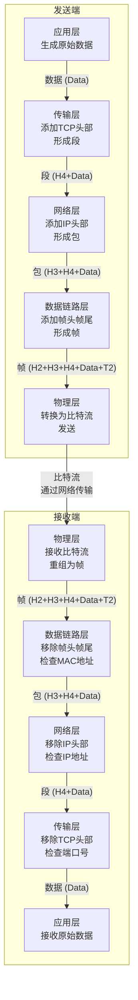

非常好！这张图非常直观和重要，它清晰地展示了数据在网络中传输时的核心过程——**封装**与**解封装**。

为了让这个过程的讲解更清晰，我根据图片内容绘制了一个更标准的示意图来描述这一流程：

---

### 对图示过程的详细解释

这个流程和图表展示了数据从发送端到接收端的完整旅程，它包含两个核心过程：

#### **发送端（左侧）：封装**

1.  **应用层**：程序生成原始数据，例如 `Data`。
2.  **传输层**：将数据分段，并加上一个**传输层头部**。这个头部包含了关键信息，如**源端口号、目的端口号**（用于区分主机上的不同应用程序）。现在数据变成了 **TPDU**。
3.  **网络层**：给段加上一个**网络层头部**。这个头部包含了关键信息，如**源IP地址、目的IP地址**（用于在全球范围内寻址）。现在数据变成了 **Packet**。
4.  **数据链路层**：给包加上一个**帧头部**和一个**帧尾部**。头部包含了**源MAC地址、目的MAC地址**（用于在本地网络内寻址），尾部通常用于**差错校验**。现在数据变成了 **Frame**。
5.  **物理层**：将帧转换成 `0` 和 `1` 的**比特流**，通过网线、光纤等物理介质发送出去。

**这个不断添加头部（和尾部）的过程，就叫做【封装】**。

#### **接收端（右侧）：解封装**

1.  **物理层**：接收比特流，将其重新组合成一个完整的帧。
2.  **数据链路层**：读取帧的MAC地址，如果目标是本机，就**去掉帧头部和尾部**，将里面的包向上传递给网络层。同时进行差错检测。
3.  **网络层**：读取IP头部，如果目标是本机，就**去掉IP头部**，将里面的段向上传递给传输层。
4.  **传输层**：读取TCP头部，根据端口号确定目标应用程序，然后**去掉TCP头部**，将原始数据向上传递给应用层。
5.  **应用层**：最终接收到发送端程序发出的原始数据。

**这个不断去除头部（和尾部）的过程，就叫做【解封装】**。

### 总结与要点

*   **头部的作用**：每一层添加的头部，都包含了该层实现其功能所需的**控制信息**（如地址、端口、校验码等）。
*   **对等通信**：发送端和接收端的同一层（如传输层对传输层），通过阅读和理解**共同的头部**，来实现逻辑上的直接对话。
*   **核心概念**：**封装**与**解封装**是网络通信的基石，它使得复杂的分层协作成为可能。

这张图完美地总结了网络体系结构的工作原理，理解了它就理解了数据包的一生。